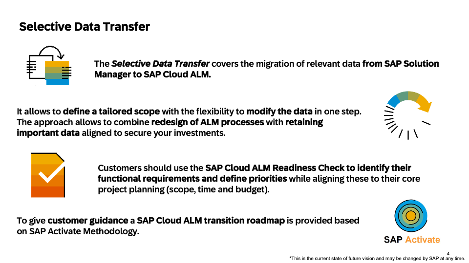
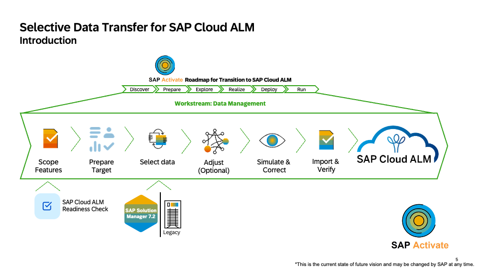
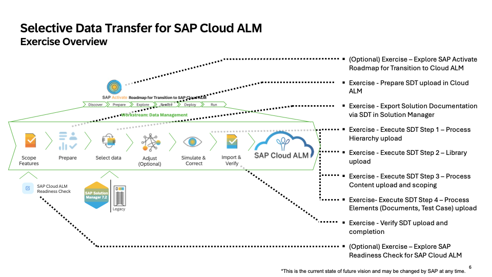

# Hands-on Overview

This session introduces attendees to learn how to move selected content from SAP Solution Manager to SAP Cloud ALM using SAP’s Selective Data Transfer (SDT) tooling. With no prerequisites and a preconfigured environment provided by SAP, this session is ideal for both newcomers and experienced users looking to explore the end-to-end migration flow through guided exercises.

# How this Hands-On Workshop Works

- Quick Intro: We’ll start with a short theory and setup to get you into the system fast.
- Learning by Doing: Most of the time is for you to work on the exercises yourself.
- Ask Anytime: You can ask questions throughout the session – we are here to help.
- Small Steps: Exercises are split into easy-to-follow chunks with just enough context so you learn and understand, not just click through.
- No Prep Needed: Everything is set up for you – just join and start.
- Guided Support: Experts will be available during the whole session to support and guide you.
- Latest Software: Exercises are based on current SAP GA releases.
# System Credentials

Link to [SAP Solution Manager 7.2](https://solman.almdemo.com/sap/bc/ui5_ui5/ui2/ushell/shells/abap/Fiorilaunchpad.html?sap-theme=sap_corbu&Action-SolutionDocumentation&sap-client=001&sap-language=EN#Shell-home)

Link to [SAP Cloud ALM](https://calm-test-eu10-004-relctestbeta-customer-11.test.eu10.alm.cloud.sap/launchpad#Launchpad-openFLPPage?pageId=BuildPage&spaceId=BuildSpace)

User: HO_SDT  
Password: SDT_to_CALM

# Selective Data Transfer overview & introduction

Let’s start with a quick overview of Selective Data Transfer (SDT).

SDT supports the migration of relevant content from SAP Solution Manager to SAP Cloud ALM — meaning you don’t need to rebuild everything from scratch.

The goal is to transfer only what’s meaningful for your current or future projects — keeping valuable documentation, processes, and test cases, while giving you the flexibility to redesign where needed.

As shown on the first slide, SDT combines:

- A tailored scope of data you choose to move,
- The ability to adjust and enrich data during the transition, and
- Guidance through SAP Activate, which provides a step-by-step transition roadmap.

On the second slide, you can see this process visualized:

We start by scoping and preparing using the SAP Cloud ALM Readiness Check, then select and adjust the data from SAP Solution Manager, simulate and verify the import, and finally complete the migration into SAP Cloud ALM.

By the end of this hands-on, you’ll understand how each of these steps works in practice — and how SDT helps you make a clean, guided, and efficient move to SAP Cloud ALM.

# Overview of Exercises

| **Exercise Title** | **Quick Description** |
| --- | --- |
| [Export Solution Documentation via SDT in SAP Solution Manager](exercises/SDT_Export/SDT_EXPORT.md) | Learn how to export selected Solution Documentation objects (processes, libraries, documents, test steps) from SAP Solution Manager using Selective Data Transfer (SDT). |
| [Prepare SDT Upload in SAP Cloud ALM](exercises/SDT_PREPARE/SDT_PREPARE.md) | Configure your SAP Cloud ALM project, assign users and scopes, and review tag management to prepare for SDT import. |
| [Execute SDT Step 1 – Process Hierarchy Upload](exercises/SDT_STEP1/SDT_STEP1.md) | Upload the exported Process Hierarchy from SAP Solution Manager and verify the imported structure in SAP Cloud ALM. |
| [Execute SDT Step 2 – Library Upload](exercise/SDT_STEP2/SDT_STEP2.md) | Import Configuration, Development, Application, Interface, and Solution Activity Libraries to re-establish technical references and process step relations. |
| [Execute SDT Step 3 – Process Content Upload and Scoping](exercise/SDT_STEP3/SDT_STEP3.md) | Upload Solution Processes and Diagrams, then perform scoping to activate relevant content and ensure proper alignment to system groups. |
| [Execute SDT Step 4 – Process Elements Upload (Documents & Test Cases)](exercise/SDT_DOCS/SDT_DOCS.md) | Upload document metadata and test cases to SAP Cloud ALM, validating ownership, relations, and traceability. |
| [Verify SDT Upload and Completion](exercise/SDT_DOCS/SDT_VERIFY_PHA.md) | Use Process Hierarchy and Solution Traceability Reports to confirm that all imported data and relationships are complete and consistent. |
| [(Optional) Explore Transition Methodology & Readiness Check](exercise/SDT_RMV/SDT_RMV.md) | Review SAP Activate Roadmap and SAP Readiness Check to understand how SDT fits into the overall transition to SAP Cloud ALM. |

## In this Hands-on you will execute this exercises top down. Please start with the first exercise in the table.
