# Google Chrome
Schulze, Axel | 16 steps | 2 minutes 
26. September 2025 
#### 1. Click on "Process Hierarchy" 
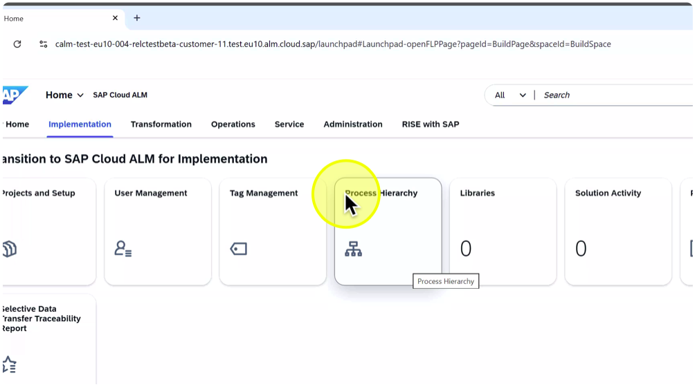 
#### 2. Click on "Process Hierarchy" 
 
#### 3. Click here 
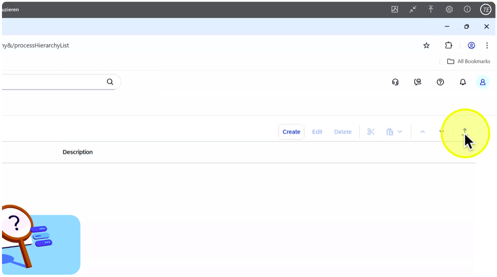 
#### 4. Click on "•• 1" 
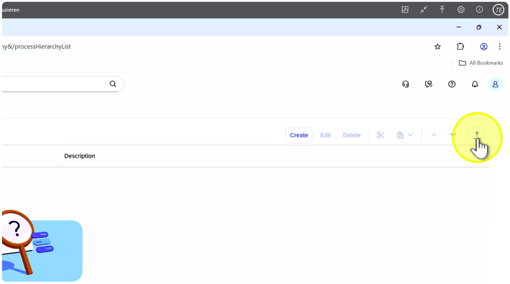 
#### 5. Click on "Browse…." 
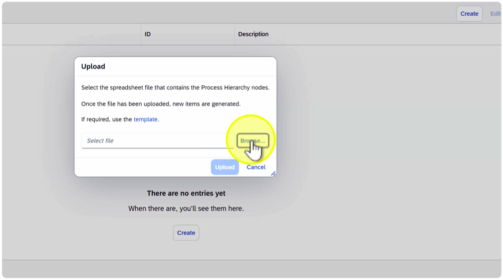 
#### 6. Click on "X\# HO\_00\_Process\_Hierarchy.xlsx" 
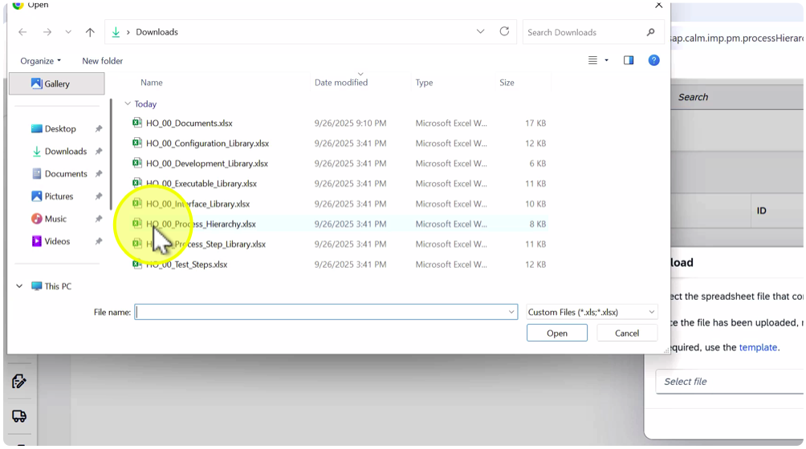 
#### 7. Click on "Open" 
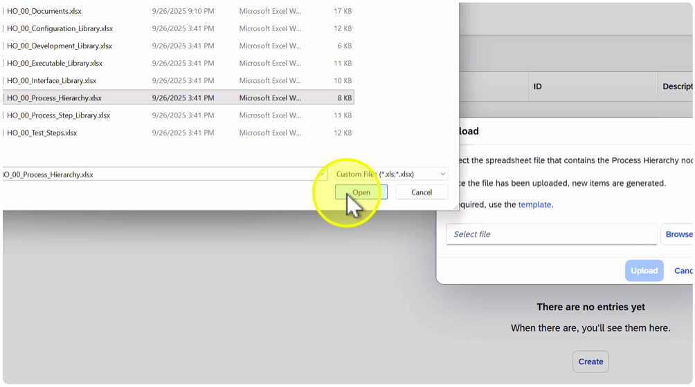 
#### 8. Click on "Upload" 
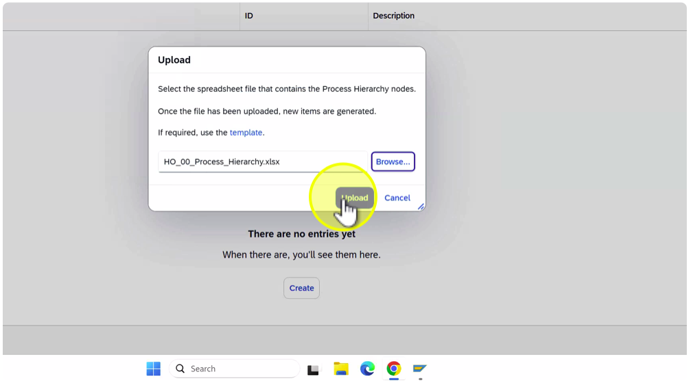 
#### 9. Click on "Continue" 
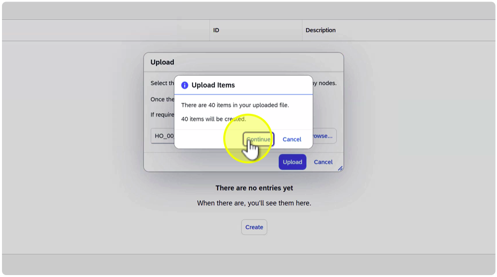 
#### 10. Click on "\> HO\_00\_Business Processes" 
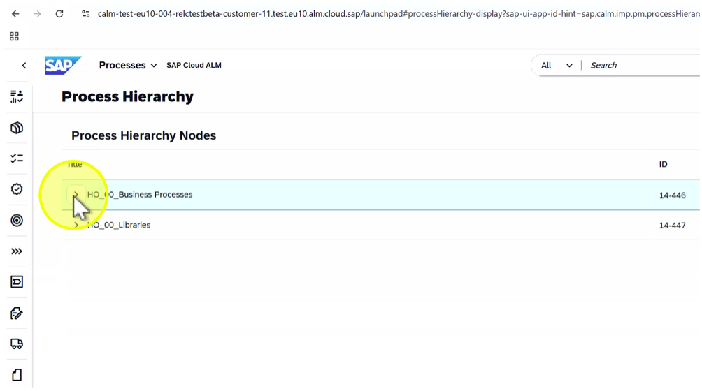 
#### 11. Click on "\> \(HO\_00\) Corporate Solution" 
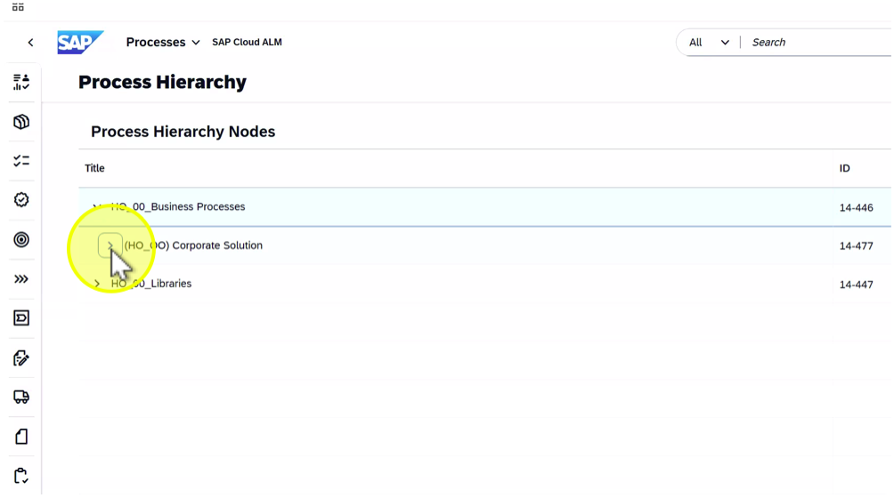 
#### 12. Click on "• 4-no-to-=no processes" 
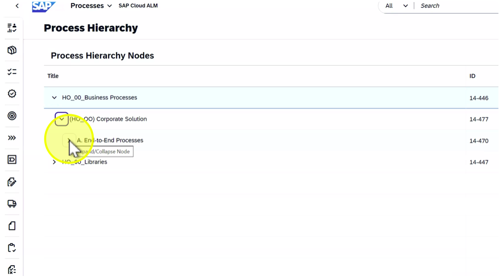 
#### 13. Click on "\> Ho-00 Libraries" 
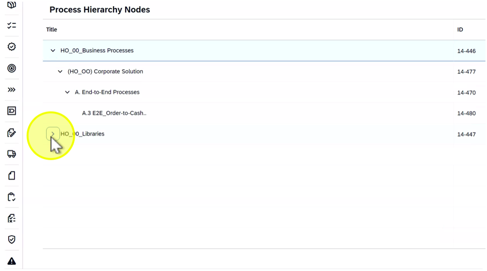 
#### 14. Click on "\> Executable Library" 
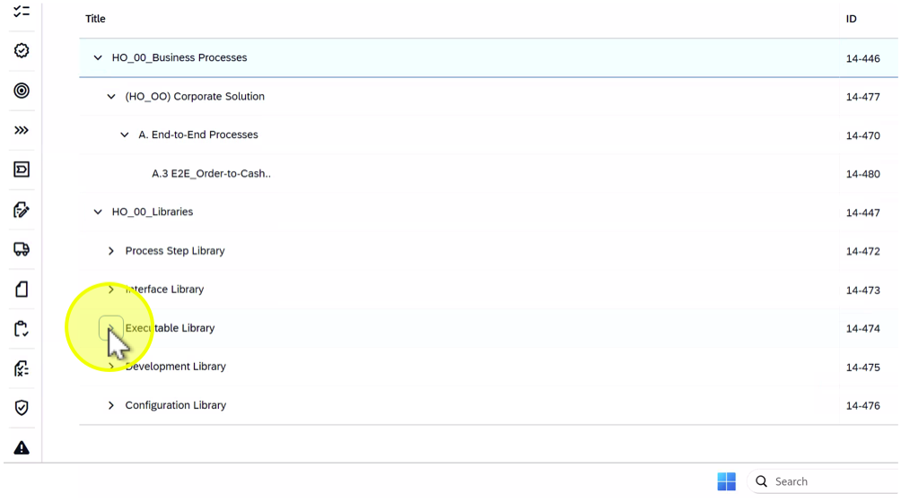 
#### 15. Click on "\> SAHANA" 
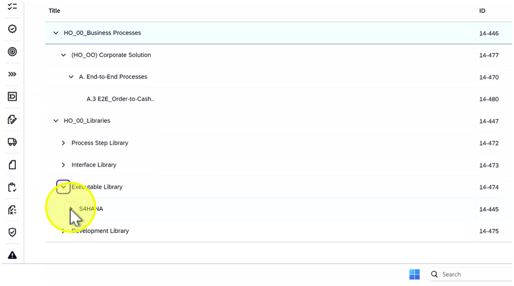 
#### 16. Click on "\> SD" 
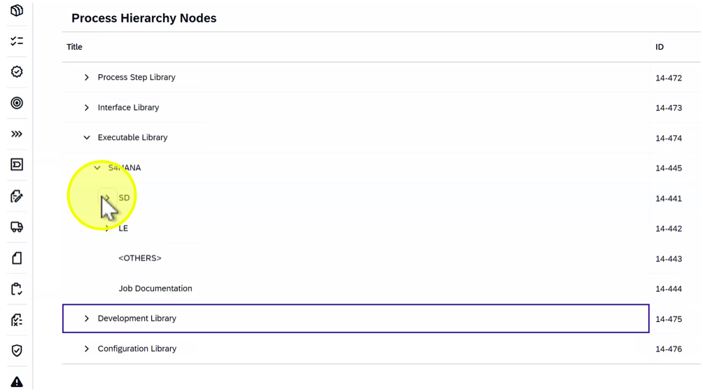 