# Exercise 1: Explore SAP Activate for Transition to SAP Cloud ALM and Transition Portal page
Description:  
In this exercise, participants will navigate to the Transition to SAP Cloud ALM roadmap in SAP Activate Roadmap Viewer to understand available guidance, assets, and key steps in the methodology. 
They will also review the Transition to SAP Cloud ALM portal page to understand SAP’s central gateway for everything you need to know to move from SAP Solution Manager to SAP Cloud ALM. 

Objective:  
Build awareness of the SAP Activate methodology and available resources to plan and structure a transition project from SAP Solution Manager to SAP Cloud ALM.  

Duration: 5 Minutes 

# Step-by-Step Guide:
### Click to open [SAP Activate Roadmap Viewer](https://me.sap.com/roadmapviewer) and follow the steps below: 
#### 1. Click on "Email, User ID or Login Name" 
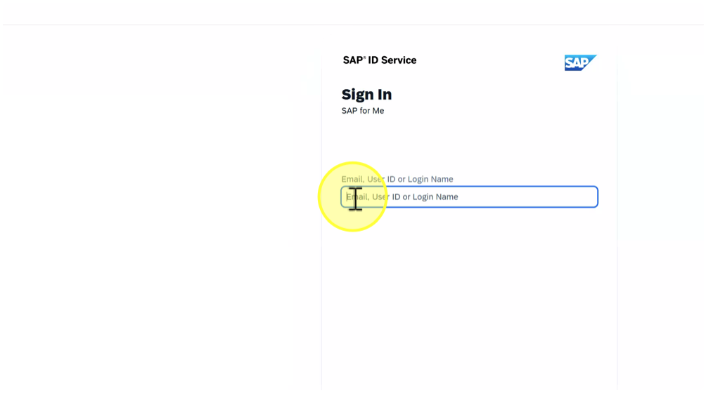 
#### 2. Click here 
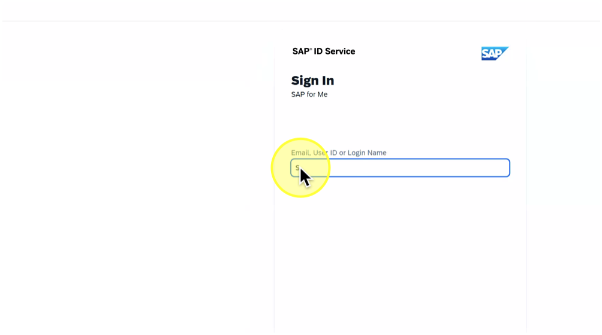 
#### 3. Click on "Continue" 
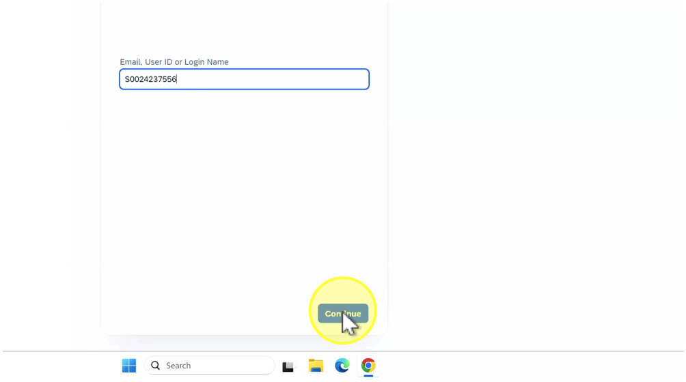 
#### 4. Click on "Continue" 
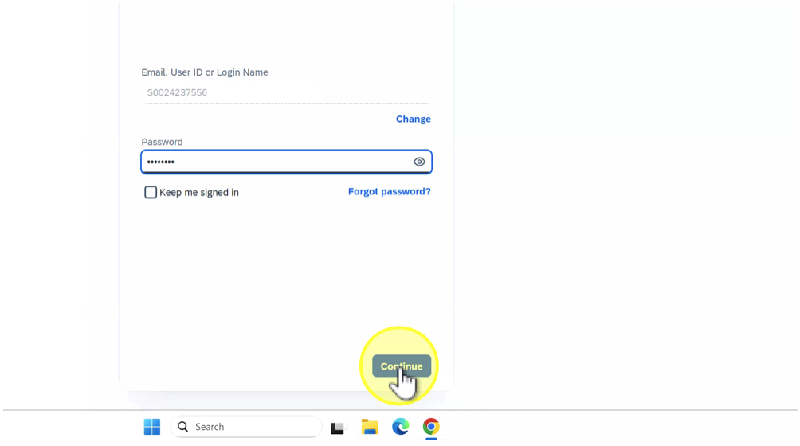 
#### 5. Click here 
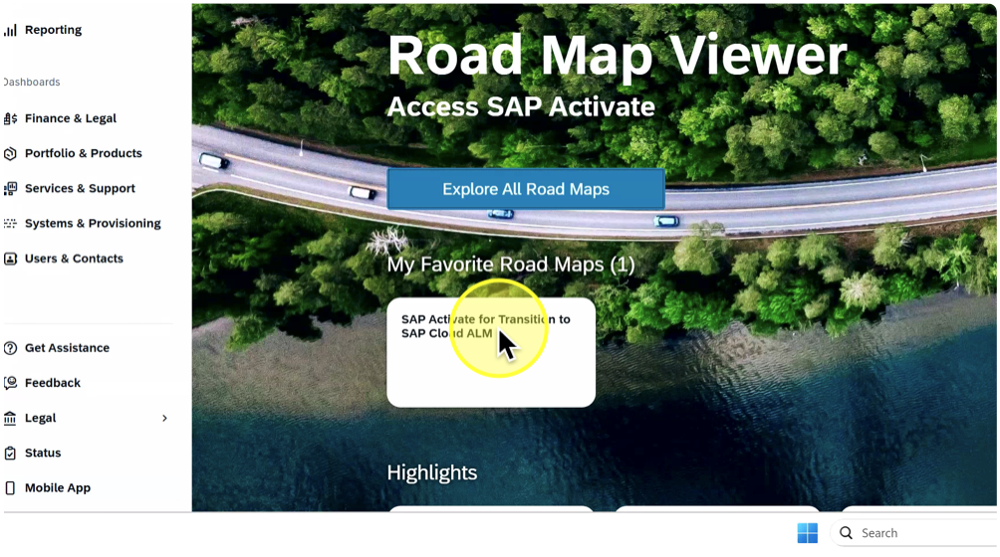 
#### 6. Click on "Overview" 
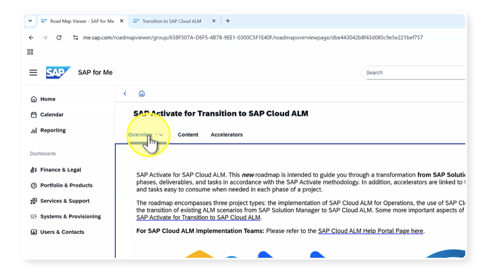 
#### 7. Click on "Content Accelerators" 
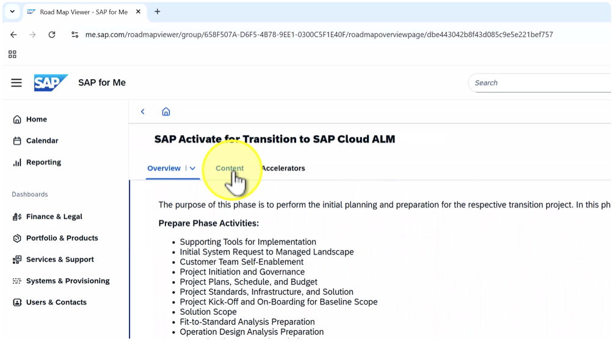 
#### 8. Click on "Workstreams" 
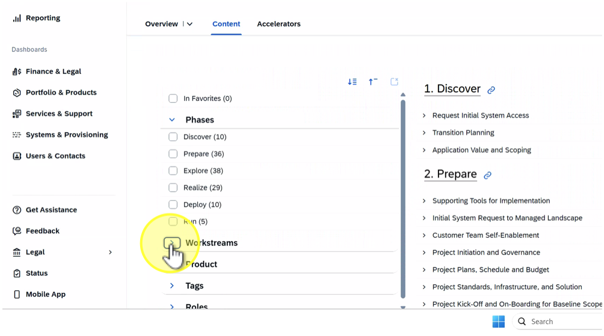 
#### 9. Click on "Data Management \(18\)" 
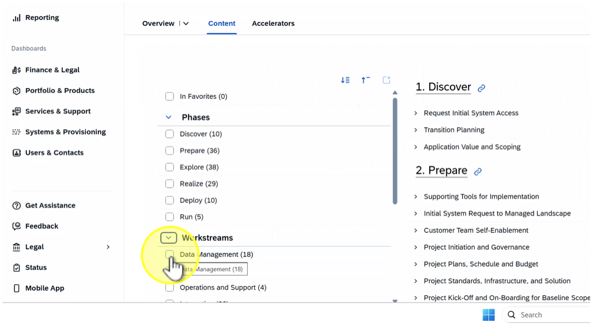 
#### 10. Click on "Customer Team Self-Enablement" 
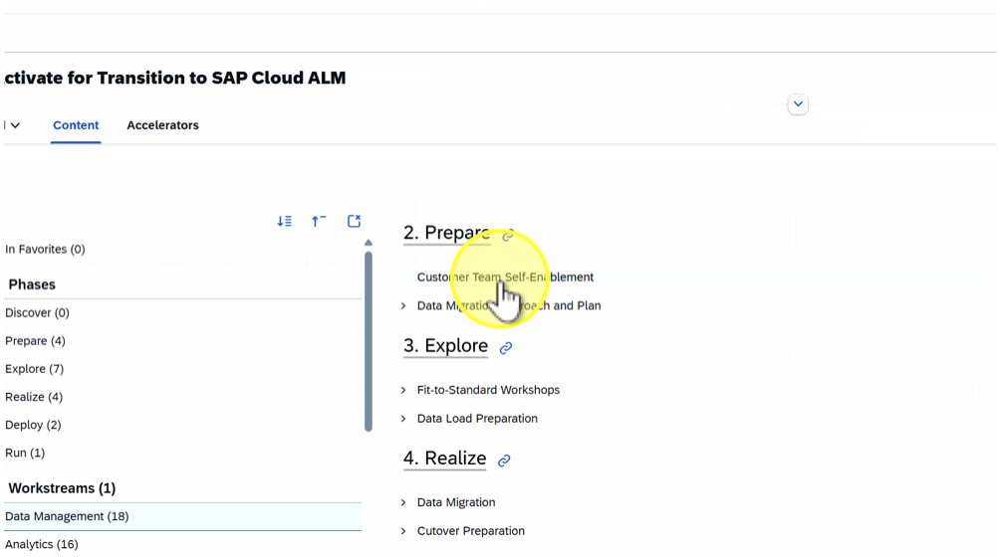 
#### 11. Click here 
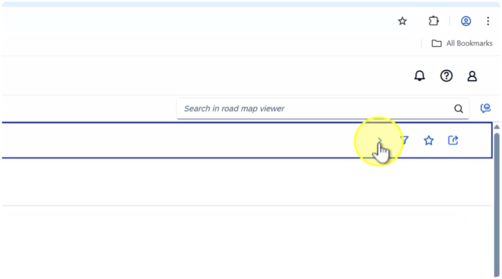 
#### 12. Click on "Accelerators" 
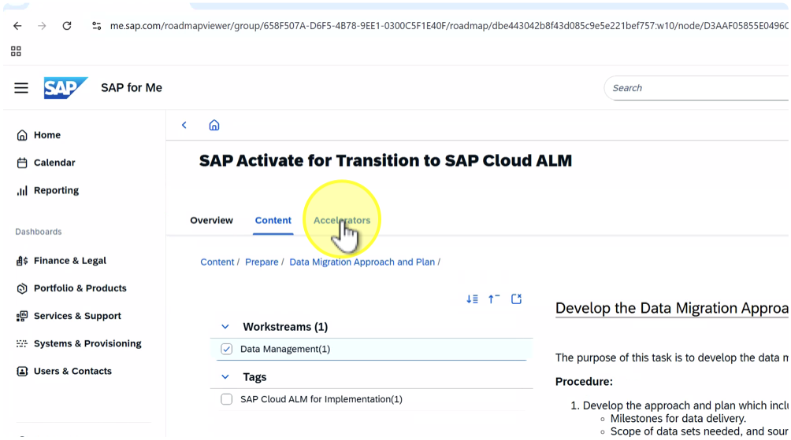 
#### 13. Click on "• Workstreams" 
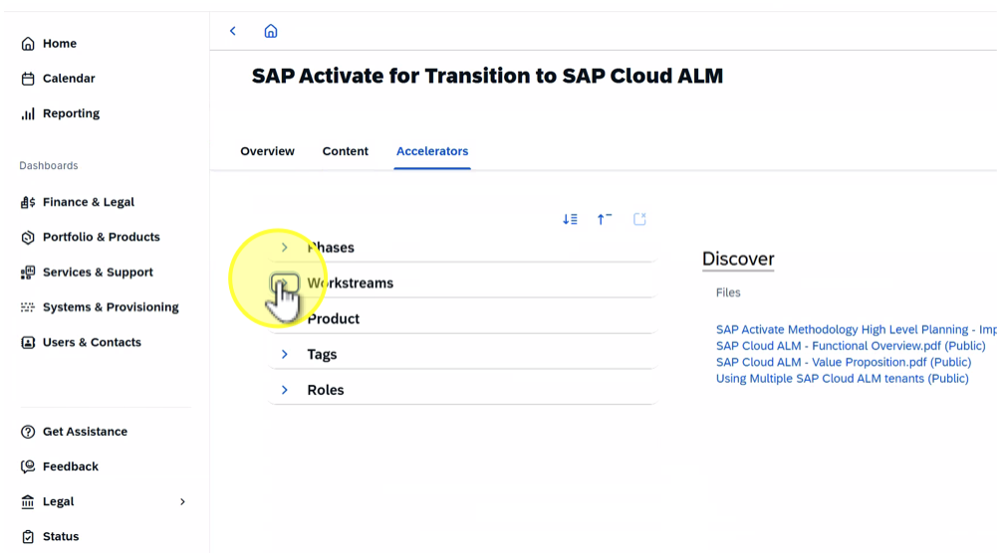 
#### 14. Click on "• Data Management\(24\)" 
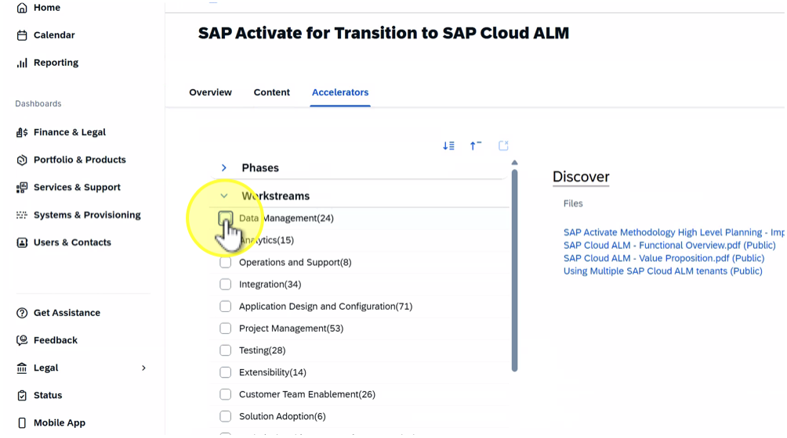 
#### 15. Click on "Transition from SAP Solution Manager to SAP Cloud ALM \(Public\)." 
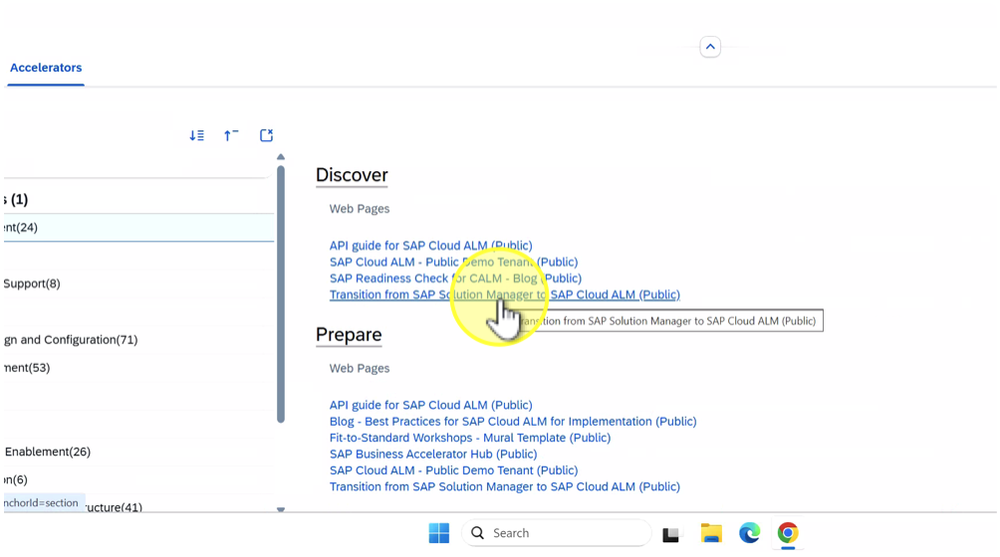 
#### 16. Click here 
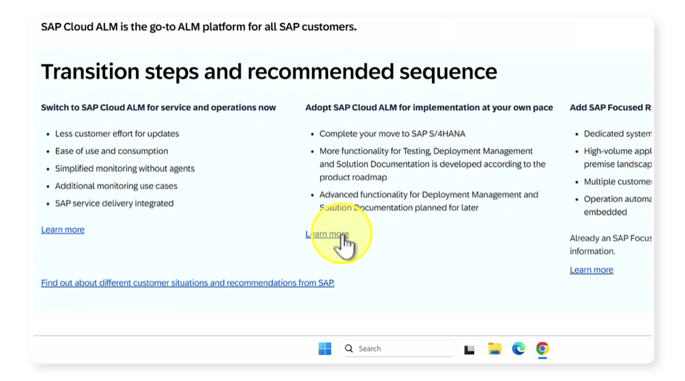 
#### 17. Click here 
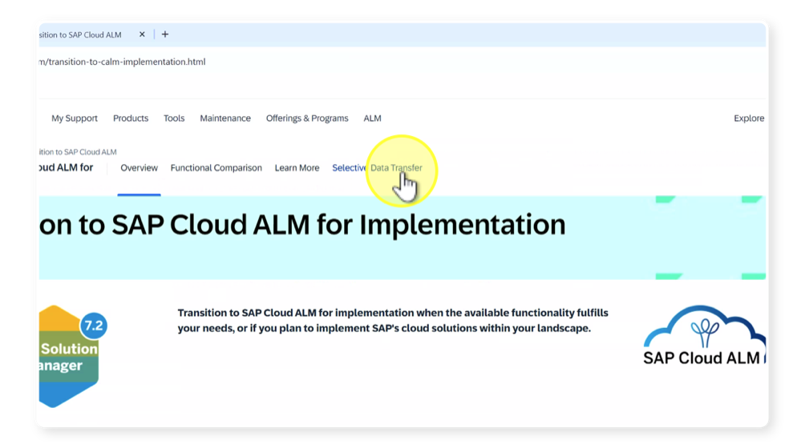 
#### 18. Click here 
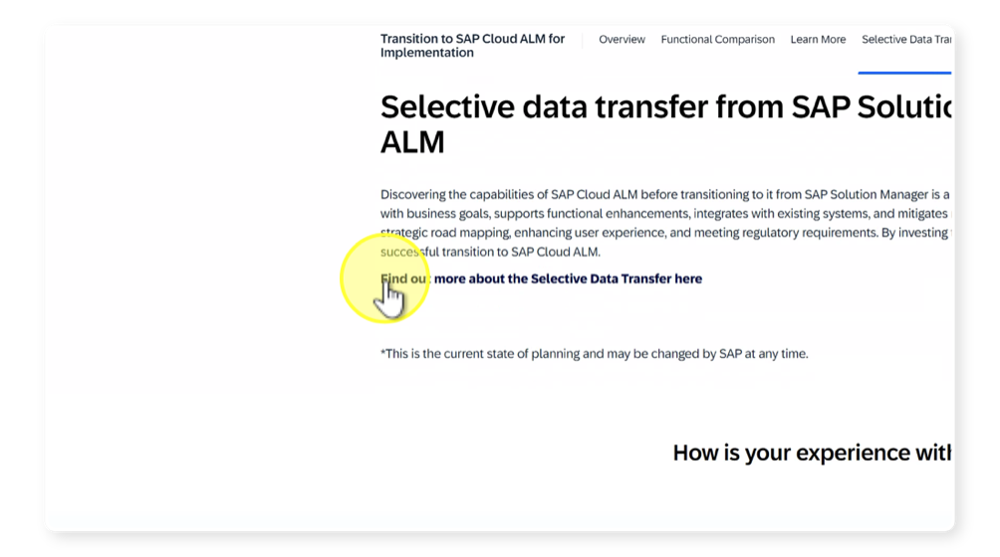 
#### 19. Click here 
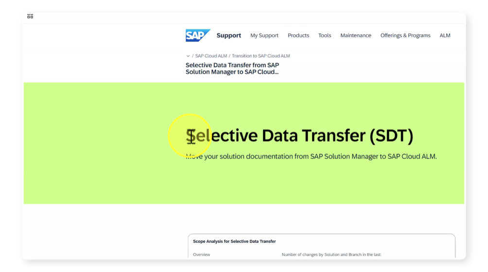 
