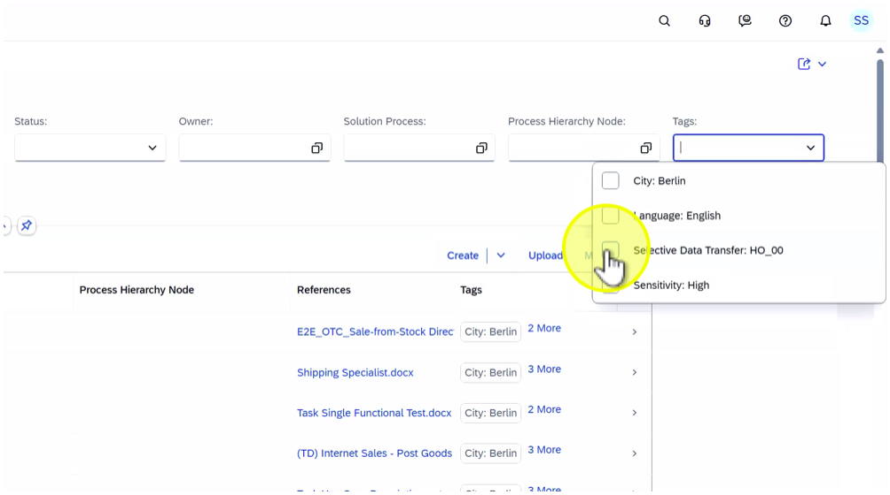
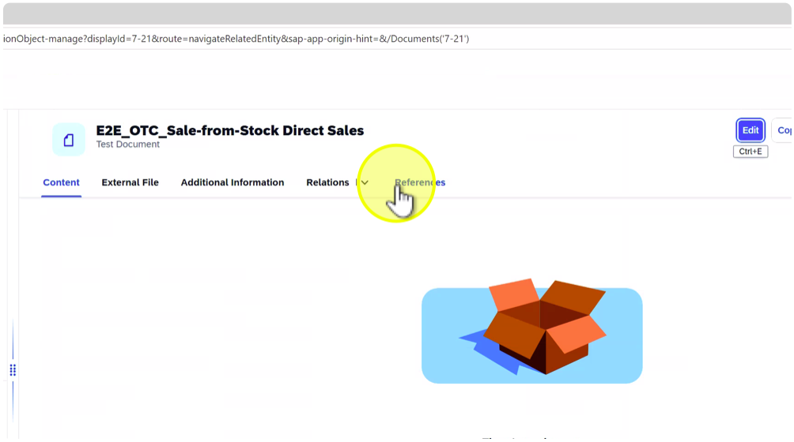

# Exercise: Execute SDT Step 4 – Process Elements (Documents, Test Case) upload

## Documents upload to SAP Cloud ALM

Remark on various option for Documents during SDT:

During Selective Data Transfer (SDT), documents attached to elements in Solution Documentation (such as processes, steps, or test cases) are exported with their metadata included in the SDT export spreadsheet.  For the physical documents the following options exist:

- Option 1 – Keep Documents in SAP Solution Manager:
Only metadata is transferred to SAP Cloud ALM with links back to SAP Solution Manager.

- Option 2 – Move Documents to External Storage: Documents are exported to external storage (e.g., SharePoint) and linked in SAP Cloud ALM.
- Option 3 – Transfer to SAP BTP Document Management System (DMS): Documents will be fully transferred and stored in SAP Cloud ALM’s integrated DMS. (On Roadmap for Q4 2025)
For simplicity reason we use Option 1 for this demo.

Description:

In this exercise, participants will review how documents exported from SAP Solution Manager are uploaded and handled in SAP Cloud ALM as part of the Selective Data Transfer (SDT). They will explore document references, understand the available transfer options, and verify that the document links and metadata are correctly visible in SAP Cloud ALM after import.

Objective:

Understand how document metadata and links are transferred during SDT, review the available transfer options, and validate that the corresponding document references are correctly associated with processes and solution elements in SAP Cloud ALM.

Duration: 10 min.

Credentials:

User: HO00 
Password: SDT_to_CALM

Step-by-Step Guide:

1. Click on "Documents"

Note: The Documents app in SAP Cloud ALM provides a central place to store, view, and manage project-related documentation.

2. Open filter for “Project”

3. Select “Demo\_SDT\_Project”

2. Click on "Upload"

3. Open value list for “Scope”

4. Select "Demo\_SDT\_Scope"

5. Click on "Browse…"

Note: Each student should upload their assigned file to ensure data isolation. (HO\_##...) (## = Student Number)

7. Select file "HO\_##\_Documents.xlsx” (## = Student Number)

8. Click on “Open”

9. Click on "Upload"

10. Click on "Continue"

11. Open filter for “Tags”

Note: The demo Selective Data Transfer (SDT) files include a dedicated tag HO\_## (## = Student Number) to make it easier to identify and select your assigned content during the exercises. This tag helps ensure that each participant works only with their own dataset, maintaining clear data separation and simplifying filtering in SAP Cloud ALM after upload.

12. Select “Selective Data Transfer: HO\_##” (## = Student Number)

13. Click on “E2E\_OTC\_Sale-from-Stock Direct Sales”

14. Click on tab “Additional Information”

Note: Check that the metadata (e.g. Title, External Reference) is visible and correctly linked to the document object.

18. Click on tab "References"

19. Click on "Relations" drop down

21. Select "Solution Processes"

22. Click on “E2E\_OST Sales-from-Stock Direct sales” to navigate to the process

24. Click on the drop down

25. Click on "Documents"

26. Click on "E2E OTC Sale-from-Stock Direct Sales" to navigate back to the document

27. Click on "References"

Note: This demonstrates that the reference points back to the original SAP Solution Manager location or external storage repository. Depending on the selected transfer option, links may point to SAP Solution Manager orexternal storage.

28. Click on the URL

29. Close the tab

30. Close the tab

31. Click on down arrow next to application name (“Documents”)

32. Select “Implementation”

Summary:

In this exercise, participants explored how documents are handled during Selective Data Transfer (SDT) from SAP Solution Manager to SAP Cloud ALM. They learned how to:- Understand and differentiate between the three document transfer options.

- Upload document metadata and verify references in SAP Cloud ALM.- Check the correct linkage between documents and solution processes.Key takeaway: SDT ensures that document references and structures are preserved in SAP Cloud ALM, maintaining traceability while providing flexibility in how document files are managed (linked, stored, or re-uploaded).
