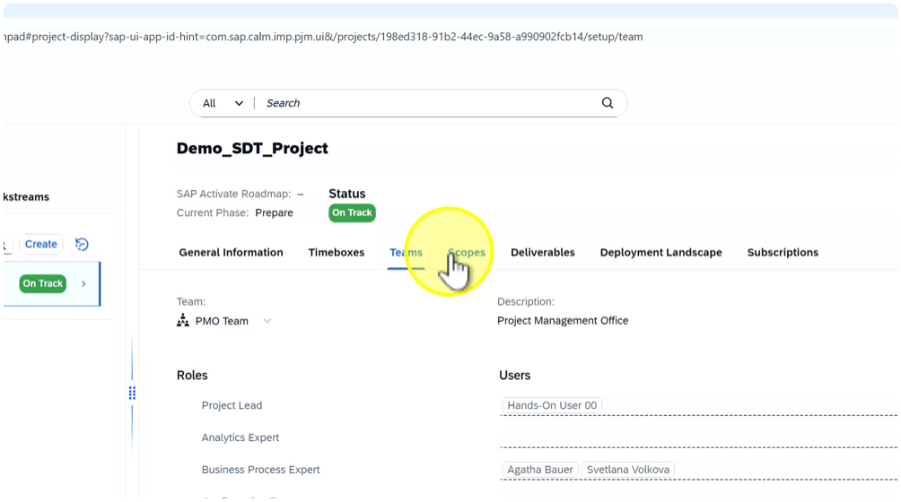
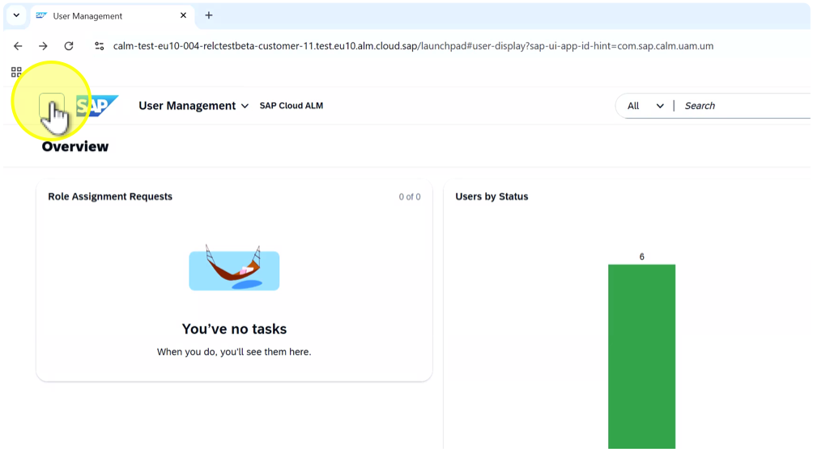

# Exercise: Prepare SDT upload in SAP Cloud ALM

## Description: 
In this exercise, participants will prepare the SAP Cloud ALM environment to receive and organize the content exported from SAP Solution Manager via Selective Data Transfer (SDT). They will review project settings, assign responsibilities, configure scopes, and prepare tag management.

## Objective: 
Build awareness of how to configure and align SAP Cloud ALM after an SDT export, ensuring a structured setup for imported content, responsibilities, and system references.

Duration: 5 minutes

## Credentials:

Click link to open [SAP Cloud ALM](https://calm-test-eu10-004-relctestbeta-customer-11.test.eu10.alm.cloud.sap/launchpad#Launchpad-openFLPPage?pageId=BuildPage&spaceId=BuildSpace) and follow the steps below:

User: HO_SDT  
Password: SDT_to_CALM

## Step-by-Step Guide:

- Click on launchpad group "Implementation"

Note: In the Implementation area of the SAP Cloud ALM Launchpad we have defined a specific Transition to SAP Cloud ALM Implementation group with all relevant tiles for the Selective Data Transfer.

- Click on tile "Projects and Setup"

- Click on project "Demo\_SDT\_Project"

Note: A project in SAP Cloud ALM serves as a central container that organizes and consolidates all relevant activities, configurations, and resources related to your transition initiative.

- Click on tab "General Information"

- Click on tab “Teams”

Note: Under Teams you define the roles, responsibilities, and access for each project team member. It ensures that users are properly assigned to project roles (e.g., Project Manager, Application Consultant, Tester) and have the correct authorizations to execute their tasks within Project and Setup.

- Click on tab "Scopes"

Note: Within a project in SAP Cloud ALM, scopes are defined to segment and focus on specific areas or phases of the transition. A scope in SAP Cloud ALM enables you to isolate certain data sets, configurations, or processes that need to be transferred from SAP Solution Manager to the new environment.

- Click on tab "System Groups"

Note: In SAP Cloud ALM, a system group is a logical grouping of SAP systems that are managed together as a single entity. The selective data transfer facilitates the mapping of logical component groups from SAP Solution Manager to system groups in SAP Cloud ALM, ensuring an accurate and efficient alignment of system structures across platforms.

- Click on system group "S4 HANA"

- Click “<” (Back) to return to the launchpad

- Click on tile "User Management"

Note: In the User Management app of SAP Cloud ALM, you can manage or display users and their roles, depending on your authorization. Users maintained in the User Management app can be assigned as owners for various entities such as solution processes, documents, or test cases, ensuring clear accountability and traceability across the project.

- Click on card "Users by Status"

- Click “<” (Back) to return to the overview page of “User Management”

- Click on “<” (Back) to return to the launchpad

- Click on tile "Tag Management"

Note: Tags in SAP Cloud ALM represent attributes transferred from SAP Solution Manager. They help filter and classify imported content.

- Click on button "Tag Groups"

Note: Review existing tag groups that have been created for our demo SDT import process.

- Click on “<” (Back)

Summary:

In this exercise, participants prepared SAP Cloud ALM to manage content imported via Selective Data Transfer (SDT). They learned how to:- Access and review the imported project structure.- Verify general project settings and assign responsible users.- Configure scopes and link the correct system groups (e.g., S/4HANA).- Review user access and tag management to ensure consistency with attributes transferred from SAP Solution Manager.Key takeaway: Proper preparation of SAP Cloud ALM ensures that imported SDT content is well-structured, traceable, and ready for ongoing implementation and operations.

# Continue to next exercise - [Execute SDT Step 1 – Process Hierarchy Upload](../SDT_STEP1/SDT_STEP1.md)
