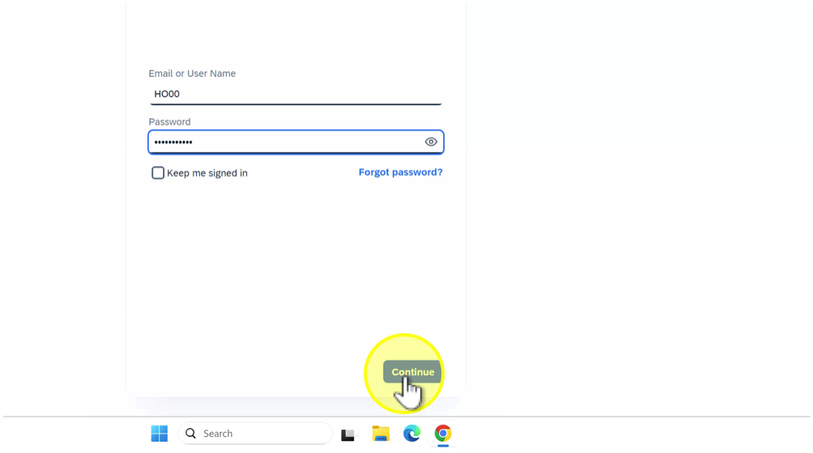
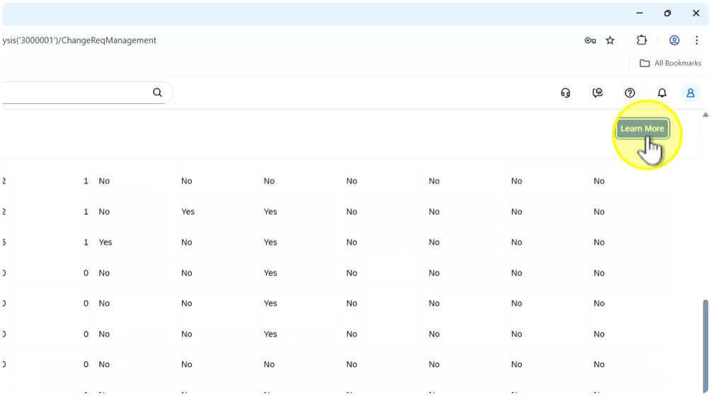

## Explore SAP Readiness Check for SAP Cloud ALM

## Description:

In this exercise, participants will explore the SAP Readiness Check for SAP Cloud ALM, navigate through different analysis areas, and understand how the tool provides insights into the current usage of SAP Solution Manager and the availability of capabilities in SAP Cloud ALM.

## Objective:

Build awareness of how the Readiness Check supports transition planning by identifying what is in use in SAP Solution Manager, how it maps to SAP Cloud ALM, and where Selective Data Transfer (SDT) can be applied.

Duration: 15–20 minutes

## Credentials:

User: HO_SDT

Passwort: SDT_to_CALM

## Step-by-Step Guide:

Click link to open [SAP Cloud ALM](https://calm-test-eu10-004-relctestbeta-customer-11.test.eu10.alm.cloud.sap/launchpad#Shell-home) and follow the steps below:

1. Click on "Email or User Name" and

2. Click on "Password"

3. Click on "Continue"

4. Click on "Service"

5. Click on "SAP Readiness"

Notes: The “SAP Readiness Check” tile is the entry point for all readiness checks, including the one for SAP Cloud ALM.

6. Click on "DEMO SDT Analyses"

Notes: The demo system contains simulated data that allows safe exploration of Selective Data Transfer (SDT) analyses.

7. Click on "Usage in SAP Solution Manager"

Notes: These will show you which areas of SAP Solution Manager are actively used. This helps determine which content is relevant for transition (e.g., process documentation, test cases).

8. Click on "Procecs Manadement"

9. Click on "Documentation Management"

10. Click on "Test Suite"

11. Click on "Test Steps"

12. Click here

13. Click on "CAP Cloud AIM canahilities"

Notes: This view compares your SAP Solution Manager usage with the capabilities currently available in SAP Cloud ALM. It highlights which functions are ready, and where differences exist.

14. Click here

15. Click here

16. Click here

17. Click here

18. Click here

19. Click on "Availability of Relevant Capabilities"

20. Click here

21. Click here

22. Click here

23. Click here

24. Click on "Change Request Management Insights"

Notes: Provides insights into ChaRM usage. Since ChaRM has a different handling in SAP Cloud ALM, the “Learn More” links guide you to transition options.

25. Click on "Learn More"

26. Click here

27. Click on "Learn More"

28. Click here

29. Click on "6 Months"

Notes: Filter usage data by timeframe (e.g., last 6 months). This helps to focus on active and relevant usage **data** of your Solution Documentation.

30. Click here

31. Click on "Scope Analysis for Selective Data Transfer"

Notes: This section shows which solution information is transtion and selctive data transfer relevant (e.g.: scopes, attributes, logical component groups, documentation relations). It supports the SDT principle: migrate only what you need.

32. Click on "DEMO SDT SOLUTION"

33. Click on "Scopes"

34. Click on "Custom Attributes"

Note: Attributes in SAP Solution Manager are transferred via Selective Data Transfer (SDT), they are represented in SAP Cloud ALM as tags. Each attribute value becomes a tag group and tag value on the migrated object. Tags can be used for filtering, searching, and grouping content in SAP Cloud ALM. This allows teams to continue using their classification logic from SAP Solution Manager without reconfiguration.

Note: Furthermore customer-defined attributes in SAP Solution Manager can be used to tag content relevant for Selective Data Transfer. This helps focus the transfer on selected processes or objects, making scoping decisions clear and consistent. Customer attributes give teams a simple way to control what gets migrated to SAP Cloud ALM. As an example in our exercise we have defined a attribute Selective Data Transfer with value HO00.

35. Click on "Business Partner Attributes"

36. Click on "Maintenance Branch|"

Note: When migrating content selectively, it is important to know from which branch the data will be taken. The branch context in Readiness Check helps ensure that only the relevant and up-to-date documentation is considered for transfer.

37. Click on "Used Logical Component Groups"

38. Click on "Used Solution Documentation Relations"

Note: The Use Solution Documentation Relations matrix helps you understand which types of Soution Documentation entities are used and how they relate to each other in SAP Cloud ALM.

39. Click here

40. Click here

41. Click here

Summary:In this exercise, participants explored the SAP Readiness Check for SAP Cloud ALM using demo data. They learned how to:

- Review the current usage of SAP Solution Manager (Process Management, Documentation, Test Suite, ChaRM).
- Compare this usage against the availability of capabilities in SAP Cloud ALM.
- Understand how the branch information (e.g., maintenance branch) help to identify which version of documentation is considered for transfer.
- Use the Solution Documentation matrix to interpret which Solution Documentation entities and relations are used
Key takeaway:

The Readiness Check provides a transparent view of what can be migrated from SAP Solution Manager to SAP Cloud ALM using SDT, and helps project teams plan their transition based on actual usage, supported capabilities, and roadmap availability.
