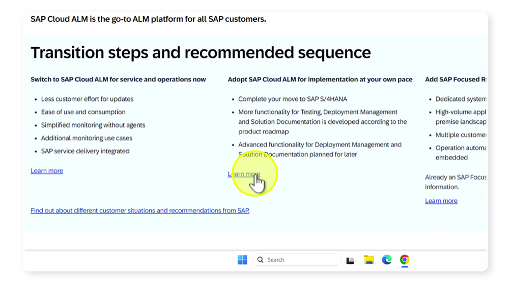

# (Optional) Exercise: Explore Transition to SAP Cloud ALM Methodology and SAP Readiness Check for SAP Cloud ALM

## Explore SAP Activate Roadmap for Transition to SAP Cloud ALM

Description:In this exercise, participants will navigate to the Transition to SAP Cloud ALM roadmap in SAP Activate Roadmap Viewer to understand available guidance, assets, and key steps in the methodology.They will also review the Transition to SAP Cloud ALM portal page to understand SAP’s central gateway for everything you need to know to move from SAP Solution Manager to SAP Cloud ALM.

Objective:Build awareness of the SAP Activate methodology and available resources to plan and structure a transition project from SAP Solution Manager to SAP Cloud ALM.

Duration: 5 Minutes

**Credentials:** 
**User:** S0024237556 
**PW:** Rctest9@

Step-by-Step Guide:

Click link to open [SAP Activate Roadmap Viewer](https://me.sap.com/roadmapviewer) and follow the steps below:

1. Click on "Email, User ID or Login Name"

    

1. Click here and enter user "S0024237556"

    

1. Click on "Continue"

    

1. Enter the passwort "Rctest9@" and click on "Continue"

    

1. Click here

    

1. Click on "Overview" of the selected SAP Activate Roadmap and review its structure and content.

    

    Note:The Overview Page of this SAP Activate Roadmap provides a high-level introduction to the Transition to SAP Cloud ALM. It explains the roadmap's purpose, the transition scenario it supports, and the main phases and deliverables. It also outlines the recommended methodology, highlights key accelerators, and links to further guidance. In short, it gives users the context, scope, and structure of the roadmap so they can understand how to use it effectively.

    **Objective:**

    Gain an understanding of the purpose, scope, and structure of the Transition to SAP Cloud ALM roadmap, and become familiar with its key phases, deliverables, and accelerators.

1. Next click on "Content"

    

    Note:The Content Page of this SAP Activate Roadmap provides a detailed breakdown of phases, deliverables, tasks, and accelerators. It allows users to navigate through the methodology step by step, filter by roles or workstreams, and directly access guidance and supporting assets. In short, it serves as the working area of the roadmap, where all actionable content is structured and accessible.

    **Next task objective:**

    Understand how the Data Management workstream supports the Transition to SAP Cloud ALM using the Selective Data Transfer (SDT) approach. Explore Data Management related task

1. Click on "Workstreams"

    

1. Click on "Data Management"

    

1. Click on "Customer Team Self-Enablement"

    

1. Click here

    

1. Next click on "Accelerators"

    

    Note:The Accelerator Page provides concrete supporting tools, templates, and links to help execute tasks such as Selective Data Transfer (SDT) and data validation. One important example is the Transition Portal Page, which guides you through the setup, available tools, and documentation for transitioning from SAP Solution Manager to SAP Cloud ALM.

    **Objective:**

    Learn how accelerators support Data Management activities in the Transition to SAP Cloud ALM roadmap by navigating to the Transition Portal Page.

1. Click on "• Workstreams"

    

1. Click on "• Data Management(24)"

    

1. Click on "Transition from SAP Solution Manager to SAP Cloud ALM (Public)."

    

    Note:The Transition to SAP Cloud ALM Portal Page provides the entry point for transitions from SAP Solution Manager to SAP Cloud ALM. It explains the transition options, methodology, available tools, and supporting assets. The page links to detailed documentation, roadmap guidance, and services that help customers plan and execute their move to SAP Cloud ALM.

1. Click here

    

1. Click here

    

1. Click here

    

1. Click here

    

    Note:The Selective Data Transfer (SDT) Page focuses on the structured migration of selected content from SAP Solution Manager to SAP Cloud ALM. It describes the SDT process (Scope → Export → Adjust → Import → Validate), offers guides and templates, and shows which entities (e.g., Process Hierarchy, Applications, Interfaces) are already supported. The page also provides FAQs, SAP Notes, and access to deep-dive documentation.

*Summary:*

In this exercise, participants explored the Transition to SAP Cloud ALM roadmap. They learned how to:

- Navigate to the Overview Page and understand the roadmap’s purpose, scope, and phases.
- Use the Content Page to see detailed tasks, deliverables, and accelerators.
- Apply the workstream filter (e.g., Data Management) to focus on role-specific content.
- Identify how the roadmap supports the Selective Data Transfer (SDT) approach by showing relevant tasks and deliverables.
Key takeaway:

The roadmap is the central guide for transition projects. It provides structure, context, and actionable content to plan and execute the move from SAP Solution Manager to SAP Cloud ALM.

# Continue to next exercise - [Explore SAP Readiness Check for SAP Cloud ALM](../SDT_RC/SDT_RC.md)
