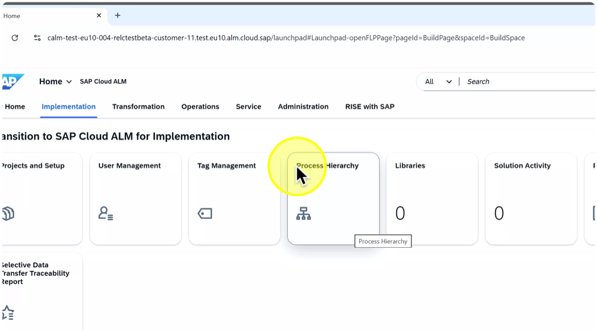
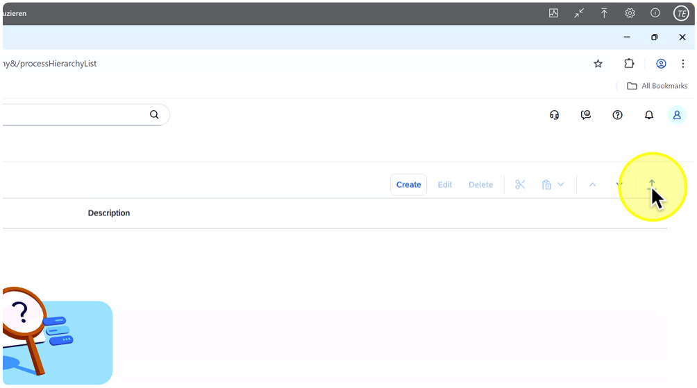
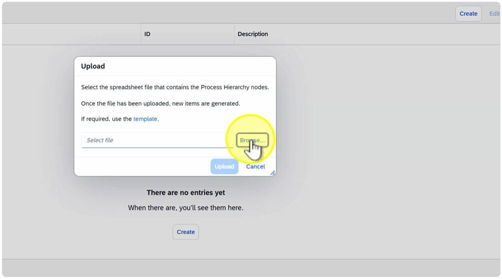
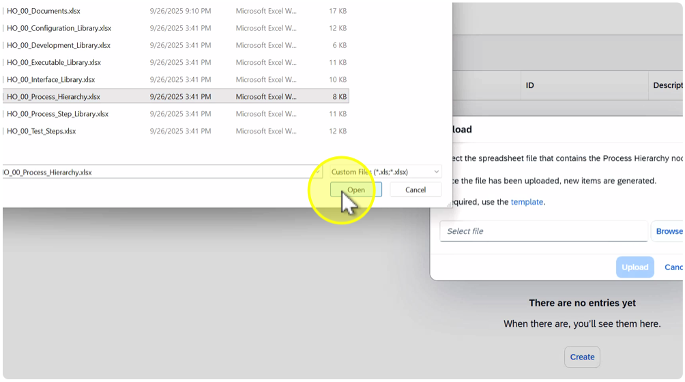
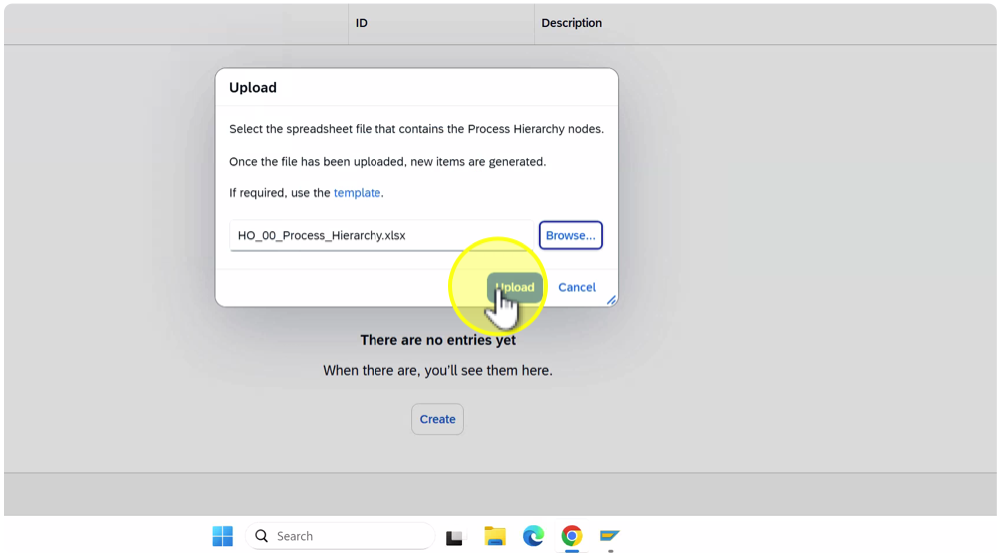
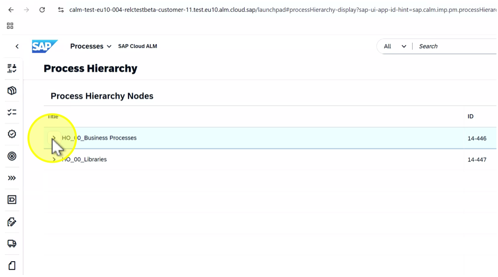
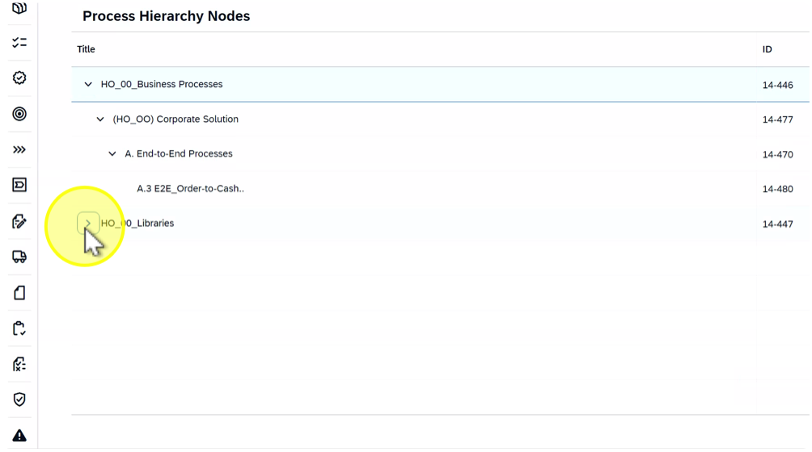
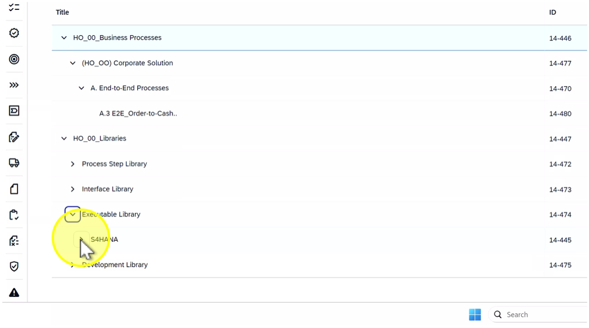

# Exercise: Execute SDT Step 1 – Process Hierarchy upload

Description:

In this exercise, participants will upload the exported Process Hierarchy from SAP Solution Manager into SAP Cloud ALM. This ensures that the business process structure from the source system becomes available in SAP Cloud ALM as part of the Selective Data Transfer (SDT).

Objective:

Build understanding of how the Process Hierarchy export from SAP Solution Manager is uploaded into SAP Cloud ALM, how validation works, and how relationships to other entities (e.g., libraries, executables) are established during the import process.

Duration: 5 minutes

Credentials:

User: HO00 
Password: SDT_to_CALM

locally and unpack afterwards

Step-by-Step Guide:

1. 1. Click on tile "Process Hierarchy"

1. Click on “Upload”

1. Click on "Browse…"

Note: Each student should upload their assigned file to ensure data isolation. (HO\_##...) ( ## = Student Number)

1. Click on "HO\_##\_Process\_Hierarchy.xlsx" ( ## = Student Number)

1. Click on "Open"

1. Click on "Upload"

1. Click on "Continue"

1. Expand process hierarchy node "HO\_00\_Business Processes"

1. Expand process hierarchy node " (HO\_00) Corporate Solution"

1. Expand process hierarchy node “A. End-to-End Processes"

1. Expand process hierarchy node "HO-00 Libraries"

1. Expand process hierarchy node "Executable Library"

1. Expand process hierarchy node "SAHANA"

1. 16. Expand process hierarchy node “SD"

Summary:

In this exercise, participants uploaded their assigned Process Hierarchy file exported from SAP Solution Manager into SAP Cloud ALM. They learned how to:- Import the Process Hierarchy file and review logs.- Validate imported structures and confirm data accuracy.Key takeaway: Understanding of how the process hierarchy is built and verified in SAP Cloud ALM.

###[Continue with next Exercise](exercise/SDT_STEP2/SDT_STEP2.md)###
