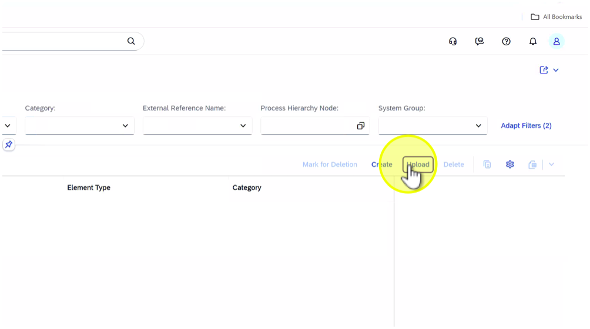
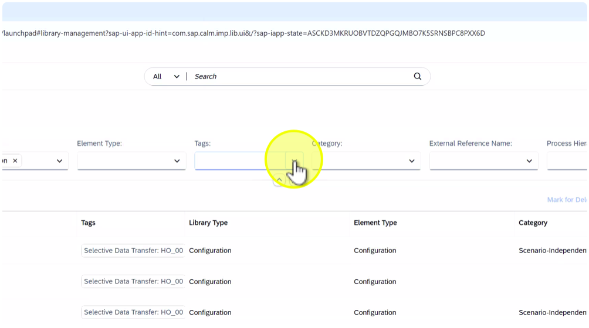
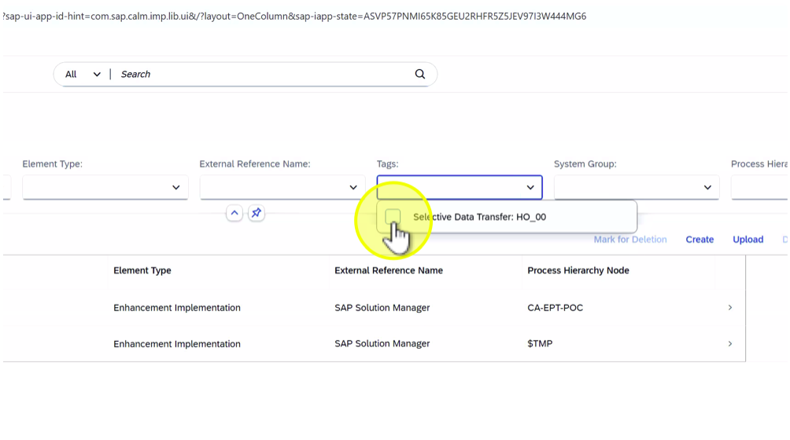
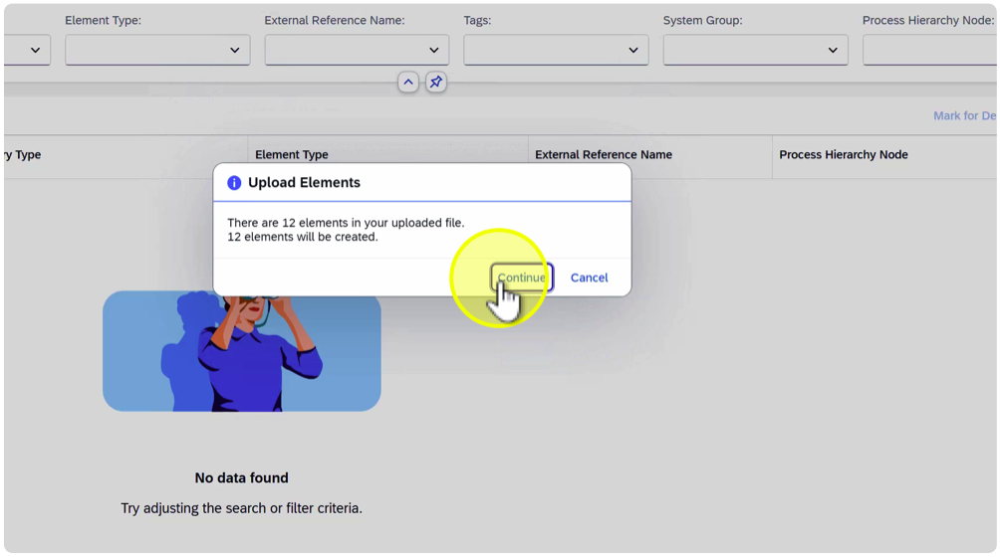
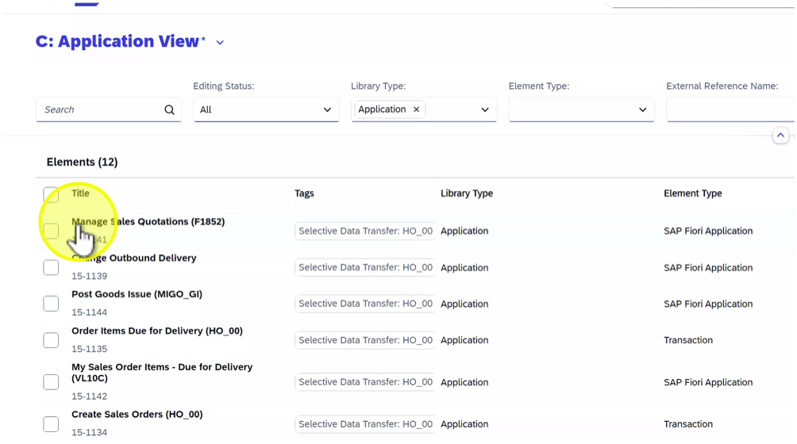

# Exercise: Execute SDT Step 2 – Library upload

## Upload of Configuration, Development, Application (Executable), Interface Library

## Description:

In this exercise, participants will upload the exported library content from SAP Solution Manager into SAP Cloud ALM. This includes the Configuration, Development, Executable, and Interface Libraries that were previously exported as part of the Selective Data Transfer (SDT). These libraries contain relations, e.g. to Process Hierarchy.

## Objective:

Understand how to upload library content into SAP Cloud ALM after SDT export, validate successful import, and verify that library items and relations (e.g., to process nodes) are properly established.

Duration: 10 minutes

## Credentials:  
User: HO_SDT 
Password: SDT_to_CALM

## Step-by-Step Guide:

1. Click on tile "Libraries"
    

    Note:The Libraries area in SAP Cloud ALM stores all reusable components such as configuration, development, executables, and interfaces.

1. Click on "Select View" to select a specific library view
    

1. Select "A: Configuration View"
    

1. Click on "Upload"
    

1. Click on "Browse..."
    

    Note:Each student should upload their assigned file to ensure data isolation. (HO\_##...) (## = Student Number)

1. Select file "HO\_##\_Configuration\_Library.xlsx" (## = Student Number)
    

1. Click on "Open"
    

1. Click on "Upload"
    

1. Click on "Continue"
    

1. Open filter for "Tags"
    

    Note:The demo Selective Data Transfer (SDT) files include a dedicated tag HO\_## (## = Student Number) to make it easier to identify and select your assigned content during the exercises. This tag helps ensure that each participant works only with their own dataset, maintaining clear data separation and simplifying filtering in SAP Cloud ALM after upload.

1. Select "Selective Data Transfer: HO\_##" (## = Student Number)
    

1. Click outside the filter to close it
    

1. Click on "Show More per Row"
    

1. Check "External Reference Name" has the value "SAP Solution Manager"
    

    Note:This confirms that the imported elements are correctly reference to the source system from which they were exported (e.g. SAP Solution Manager).

1. Click on tab "Process Hierarchy Nodes"
    

    Note:During the Selective Data Transfer (SDT) upload, relations between objects (e.g., Libraries and the Process Hierarchy) are automatically created based on the exported references from SAP Solution Manager.

    This ensures that documentation in SAP Cloud ALM remain linked to their corresponding configurations, executables, and interfaces, preserving end-to-end traceability after transition.

1. Click on "x" (Close)
    

1. Click on "Select View"
    

1. Select "B: Development View"
    

    Note:The Development Library contains custom developments and related entities used across processes. Upload the corresponding file.

1. Click on "Upload"
    

1. Click on "Browse..."
    

    Note:Each student should upload their assigned file to ensure data isolation. (HO\_##...) (## = Student Number)

1. Select file "HO\_##\_Development\_Library.xlsx" ( ## = Student Number)
    

1. Click on "Open"
    

1. Click on "Upload"
    

1. Click on "Continue"
    

1. Open filter for "Tags"
    

1. Select "Selective Data Transfer: HO\_##" (## = Student Number)
    

1. Open filter for "System Group"
    

    Note:When uploading Libraries via Selective Data Transfer (SDT), the imported items are automatically assigned to the relevant system group defined in the project setup.

    This ensures that configurations, executables, and interfaces are correctly linked to the target systems in SAP Cloud ALM, maintaining consistency with the original SAP Solution Manager landscape.

1. Select "S4 HANA"
    

1. Click outside the filter to close it
    

1. Click on "Select View"
    

1. Select "C: Application View"
    

    Note:The Executable Library contains business applications and transactions. These links are essential for process execution context.

1. Click on "Upload"
    

1. Click on "Browse..."
    

    Note:Each student should upload their assigned file to ensure data isolation. (HO\_##...) ( ## = Student Number)

1. Select file "HO\_##\_ Executable\_Library.xlsx" (## = Student Number)
    

1. Click on "Open"
    

1. Click on "Upload"
    

1. Click on "Continue"
    

1. Open filter for "Tags"
    

1. Select "Selective Data Transfer: HO\_##" (## = Student Number)
    

1. Click on "Manage Sales Quotations (F1852)" in the element list
    

1. Check "System Group"
    

    Note:When uploading Libraries via Selective Data Transfer (SDT), the imported items are automatically assigned to the relevant system group defined in the project setup.

    This ensures that configurations, executables, and interfaces are correctly linked to the target systems in SAP Cloud ALM, maintaining consistency with the original SAP Solution Manager landscape.

1. Click on "Change Outbound Delivery" in the element list
    

1. Collapse the filter area
    

1. Click on "Create Sales Orders (HO\_##)" (## = Student Number) in the element list
    

1. Click on tab "Configurations" on the detail view
    

    Note:During the Selective Data Transfer (SDT) upload, relations between objects (e.g., Libraries and the Process Hierarchy) are automatically created based on the exported references from SAP Solution Manager.

    This ensures that processes in SAP Cloud ALM remain linked to their corresponding configurations, executables, and interfaces, preserving end-to-end traceability after migration.

1. Click on "Storage Types"
    

1. Click on "x" (Close) to close the detail view
    

1. Click on "Select View"
    

1. Select "D: Interface View"
    

    Note:The Interface Library includes interfaces and integrations relevant to processes and applications.

1. Click on "Upload"
    

1. Click on "Browse…"
    

    Note:Each student should upload their assigned file to ensure data isolation. (HO\_##...) ( ## = Student Number)

1. Select file "HO\_##\_Interface\_Library.xlsx" ( ## = Student Number)
    

1. Click on "Open"
    

1. Click on "Upload"
    

1. Click on "Continue"
    

1. Open the filter "Tags"
    

1. Select "Selective Data Transfer: HO\_##" (## = Student Number)
    

1. Click on "Confirm Goods Issue" in the element list
    

1. Click on tab "Applications" in the detail view
    

    Note:During the Selective Data Transfer (SDT) upload, relations between objects (e.g., Libraries and the Process Hierarchy) are automatically created based on the exported references from SAP Solution Manager.

    This ensures that processes in SAP Cloud ALM remain linked to their corresponding configurations, executables, and interfaces, preserving end-to-end traceability after migration.

1. Click on "Send Deliveries to Warehouse" in the element list
    

1. Click on tab "Configurations" in the detail view
    

1. Click on tab "Interfaces"
    

1. Click on "Sales to Warehouse" in the element list
    

1. Click on tab "Interfaces" in the detail view
    

1. Click on tab "Process Hierarchy Nodes"
    

1. Click on "x" (Close) to close the detail view
    

1. Click on "<" (Back)
    

1. Click on down arrow next to the application name ("Libraries")
    

1. Select "Implementation"
    

*Summary:*

In this exercise, participants uploaded various libraries (Configuration, Development, Executable, and Interface) from SAP Solution Manager into SAP Cloud ALM. They learned how to:1. Access the Libraries area and navigate between different library views.1. Upload the predefined SDT export files using SAP's import templates.1. Validate logs and confirm successful import.1. Verify cross-references between library objects and process nodes.Key takeaway: Uploading libraries after the Process Hierarchy ensures that all reusable elements and references from SAP Solution Manager are correctly re-established in SAP Cloud ALM, forming the foundation for consistent process documentation and analysis.

# Continue to [SDT Upload for Solution Activities](../SDT_STEP2_SOLACT/SDT_STEP2_SOLACT.md)
