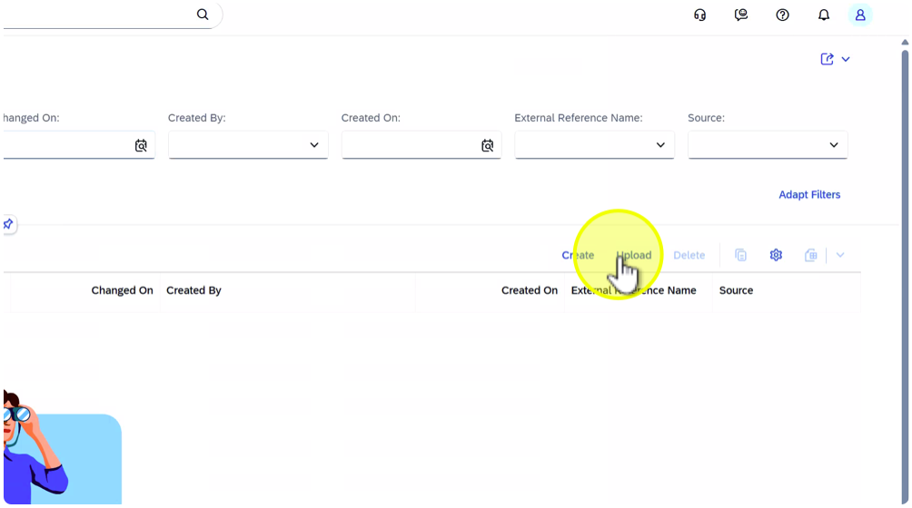

## Upload of Solution Activity (Process Step) Library

## Description:

In this exercise, participants will upload the Solution Activity (Process Step) Library exported from SAP Solution Manager into SAP Cloud ALM. The Solution Activity (Process Step) Library contains reusable process steps that are linked to the Process Hierarchy and Libraries.

## Objective:

Understand how to upload the Solution Activity (Process Step) Library to SAP Cloud ALM, verify relations to process hierarchy nodes, configurations and applications.

Duration:  5 minutes

## Credentials:

User: HO_SDT 
Password: SDT_to_CALM

## Step-by-Step Guide:

1. Click on tile "Solution Activity"

    

1. Click on "Upload"

    

1. Click on "Browse…"

    

    Note: Each student should upload their assigned file to ensure data isolation. (HO\_##...) (## = Student Number)

1. Select file "HO\_##\_Process \_Step \_Library.xlsx" (## = Student Number)

    

1. Click on "Open"

    

1. Click on "Upload"

    

1. Click on "Continue"

    

    Note: When several participants upload the Solution Activity Library, identical activity names (e.g., Create Sales Orders) may appear multiple times in the list.This is expected, as each upload represents a separate dataset from a different participant.

1. Click on "Create Sales Orders"

    

    Note: Open this Solution Activity to verify the relations.

1. Click on tab "Applications" in the detail view

    

    Note: Check that the Solution Activity is correctly linked to the corresponding application.

1. Click on tab "Configurations"

    

    Note: Check that the Solution Activity is correctly linked to the corresponding Configuration.

1. Click on tab "Process Hierarchy Nodes"

    

    Note:     Note: Open a Solution Activity to verify the relation between the previous uploaded Process Hierarchy.

1. Click on "x" (Close) to close the detail view

    

1. Click on down arrow next to the application name ("Solution Activity")

    

1. Select "Implementation"

    

*Summary:*

In this exercise, participants uploaded the Solution Activity (Process Step) Library exported from SAP Solution Manager into SAP Cloud ALM. They learned how to:- Use the Solution Activity app to manage elements.- Validate the upload and check for successful import.- Verify relations between various elements.Key takeaway: Uploading the Solution Activity (Process Step) Library ensures that all detailed process steps and their technical references from SAP Solution Manager are successfully re-established in SAP Cloud ALM, preserving end-to-end process traceability.

# Continue to next exercise - [Execute SDT Step 3 – Process Content Upload and Scoping](../SDT_STEP3/SDT_STEP3.md)
