# Exercise: Execute SDT Step 3 – Process Content upload and scoping

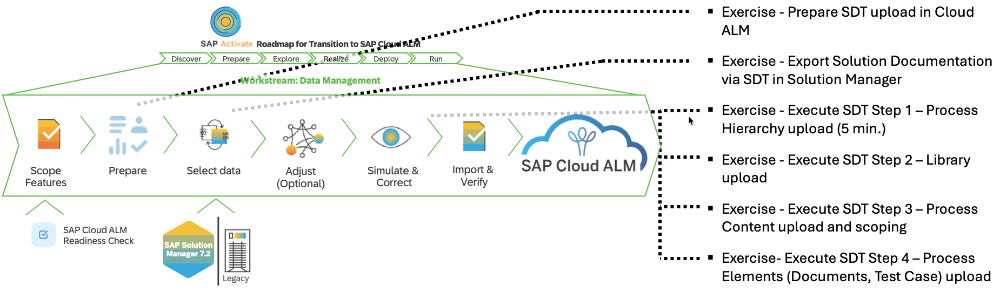

## Upload Solution Processes and Diagrams to SAP Cloud ALM

## Description:

In this exercise, participants will upload the Solution Processes and Diagrams that were exported from SAP Solution Manager as part of the Selective Data Transfer (SDT). This step imports process definitions, process flows, and BPMN diagrams into SAP Cloud ALM, making the business process visualisation available for further use and refinement.

## Objective:

Learn how to upload processes and diagrams to SAP Cloud ALM, validate the import, and verify that the process structures and visual diagrams are correctly linked to the Process Hierarchy.

Duration: 10 minutes

## Credentials:

User: HO_SDT 
Password: SDT_to_CALM

## Step-by-Step Guide:

1. Click on tile "Process Authoring"

    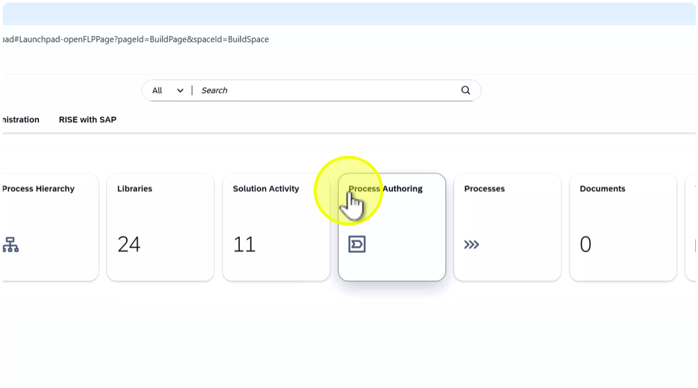

    Note: The Process Authoring app in SAP Cloud ALM allows you to create, import, and manage business processes and diagrams.

1. Click on "Upload"

    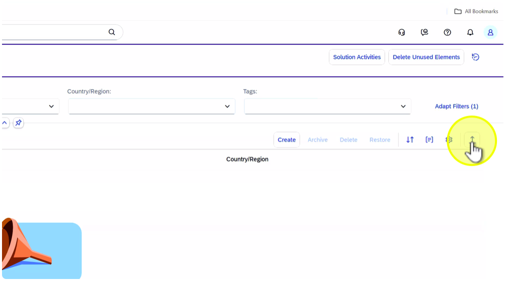

1. Click on "Browse..."

    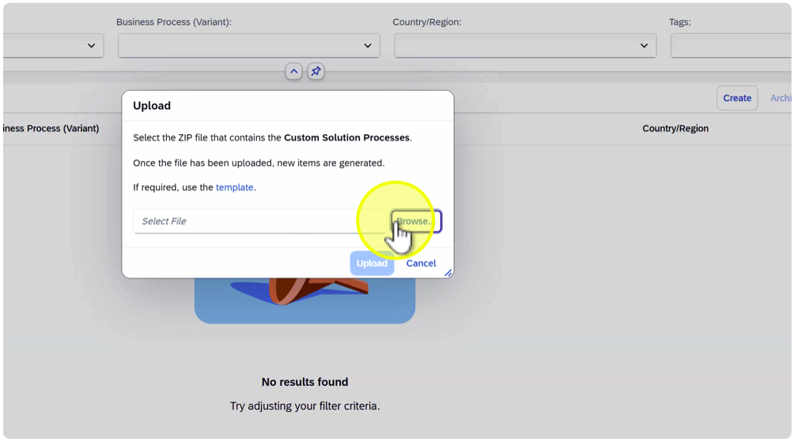

    Note: Each student should upload their assigned file to ensure data isolation. (HO\_##...) (## = Student Number). The ZIP file contains the exported BPMN diagrams and process structure from SAP Solution Manager. Ensure you select the correct file.

1. Select file "HO\_##\_Process\_and\_Diagram.zip" (## = Student Number).

    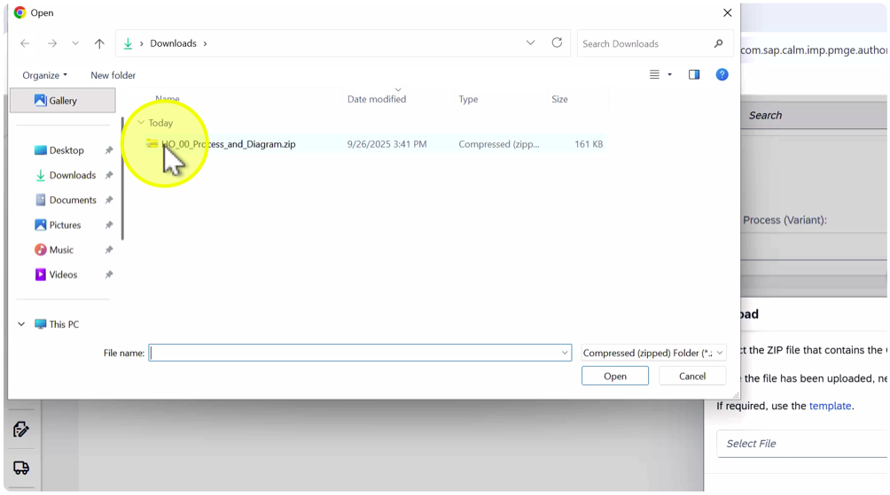

    Note: The ZIP file contains the exported BPMN diagrams and process structure from SAP Solution Manager. Ensure you select the correct file.

1. Click on "Open"

    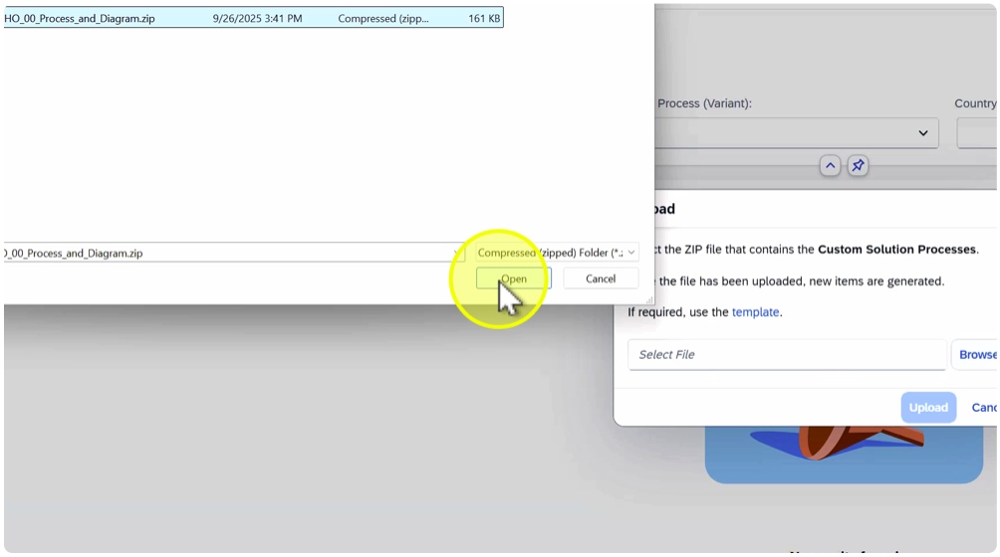

1. Click on "Upload"

    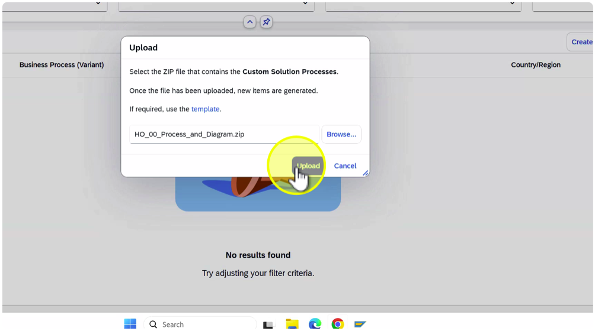

1. Click on "Continue"

    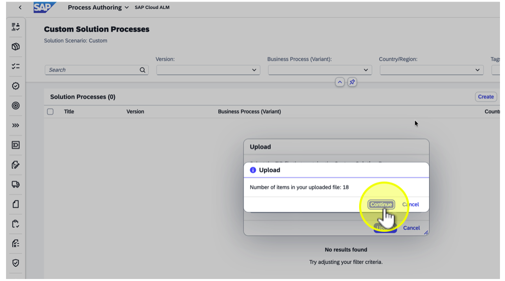

1. Open filter for "Tags"

    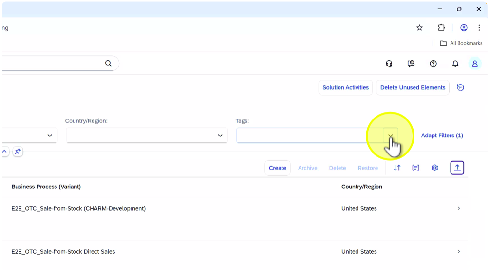

    Note: The demo Selective Data Transfer (SDT) files include a dedicated tag HO\_## (## = Student Number) to make it easier to identify and select your assigned content during the exercises. This tag helps ensure that each participant works only with their own dataset, maintaining clear data separation and simplifying filtering in SAP Cloud ALM after upload.

1. Select "Selective Data Transfer: HO\_## (## = Student Number)

    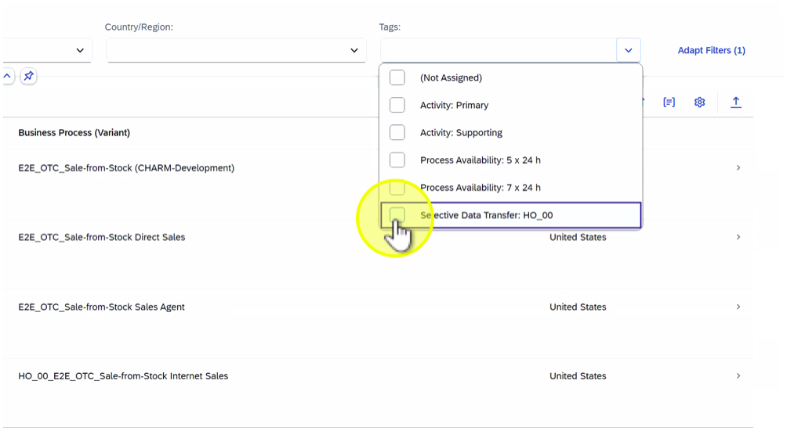

1. Click on "E2E\_OTC\_Sale-from-Stock (CHARM-Development)"

    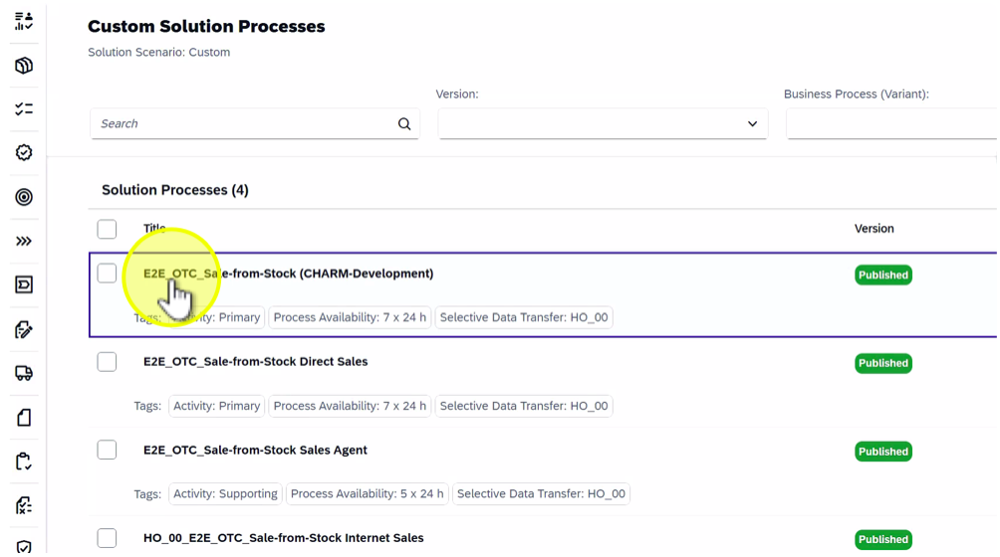

    Note: Verify that processes have been successfully imported and that their BPMN diagrams are visible and functional.

1. Click on tab "Relations"

    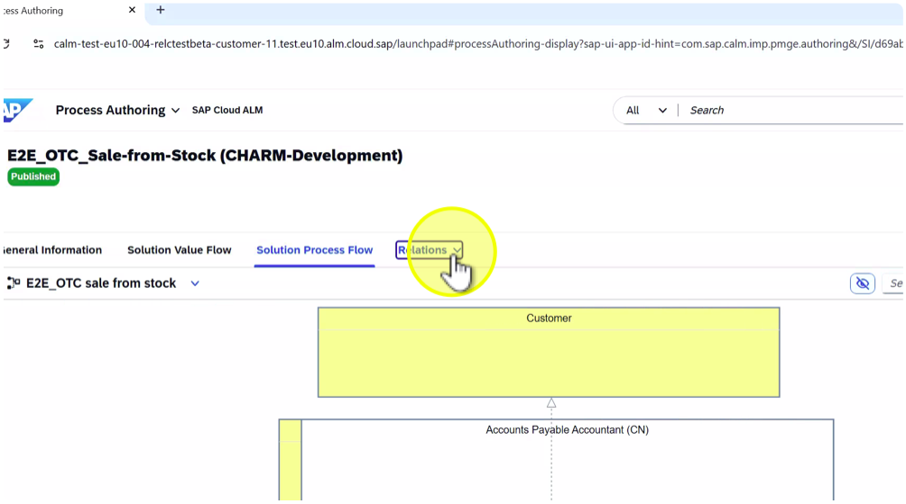

1. Select "Process Hierarchy Nodes"

    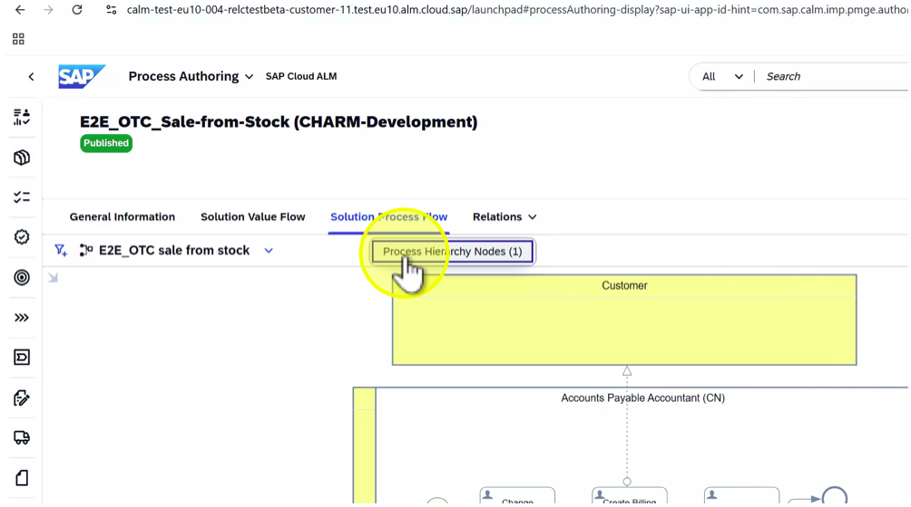

    Note: Here you can confirm that the imported processes are properly related to the corresponding Process Hierarchy Nodes. These relationships ensure process context is preserved after SDT.

1. Click on tab "General Information"

    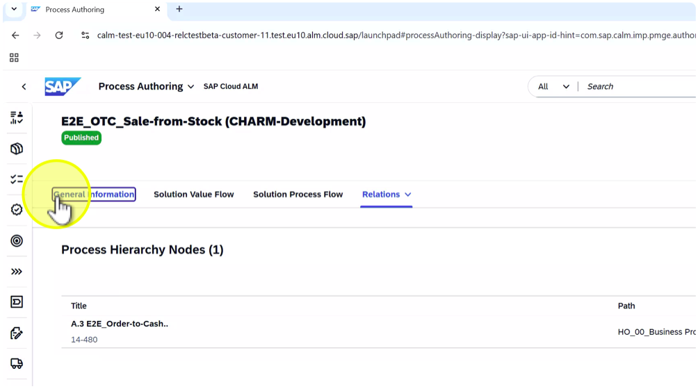

1. Click on down arrow next to application name ("Process Authoring")

    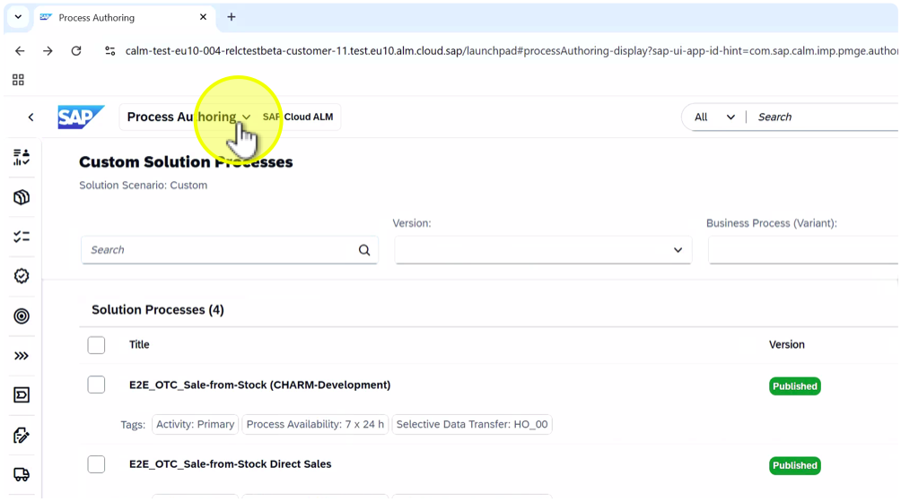

1. Select "Implementation"

    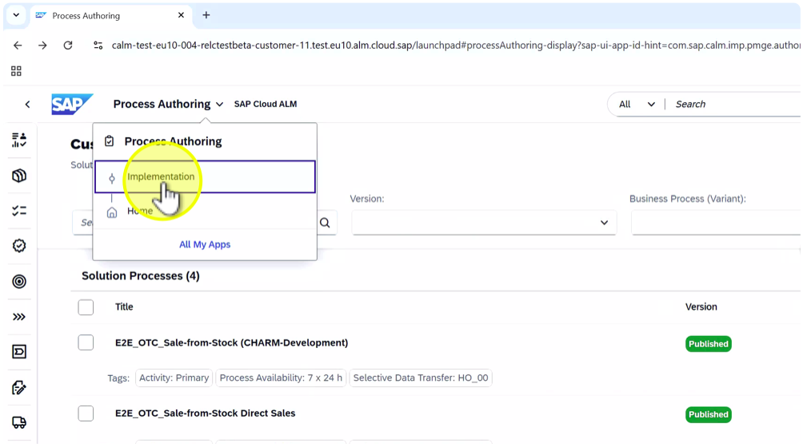

*Summary:*

In this exercise, participants uploaded the Solution Processes and BPMN Diagrams exported from SAP Solution Manager into SAP Cloud ALM. They learned how to:- Use the Process Authoring app to import process content.- Upload ZIP files containing processes and diagrams.- Verify that processes are correctly linked to the Process Hierarchy.- Review imported BPMN diagrams for visual and structural accuracy.Key takeaway: Uploading processes and diagrams ensures that the business process structure and visualizations from SAP Solution Manager are re-established in SAP Cloud ALM, providing a consistent and complete transition for process documentation.

# Continue to next exercise - [Perform Scoping in SAP Cloud ALM](../SDT_SCOPING/SDT_SCOPING.md)
