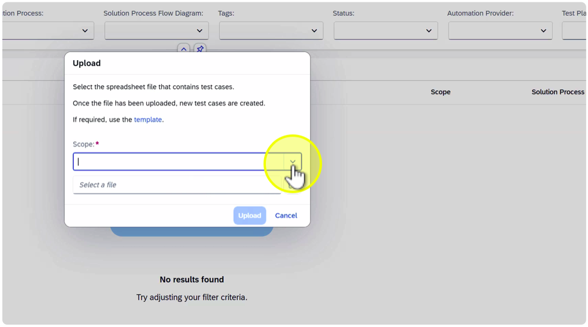
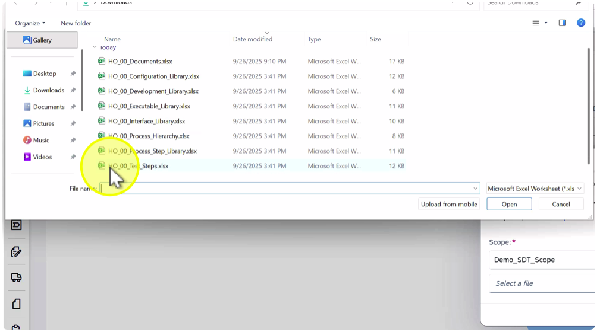
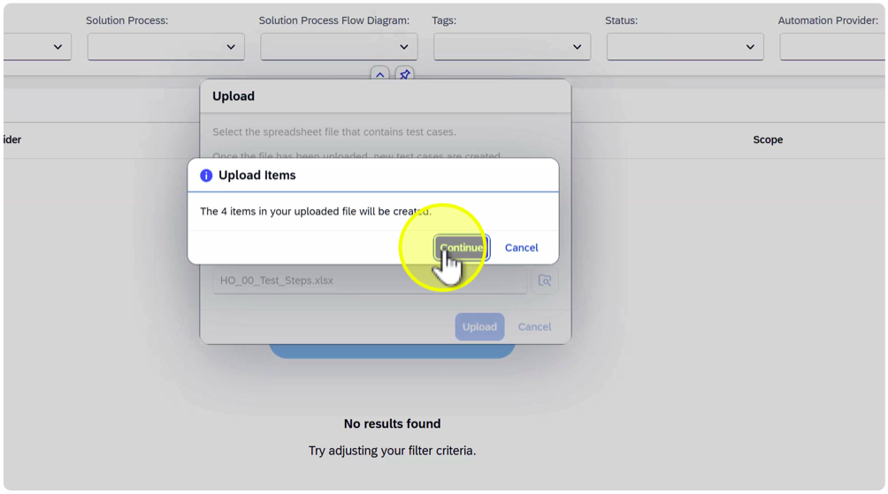
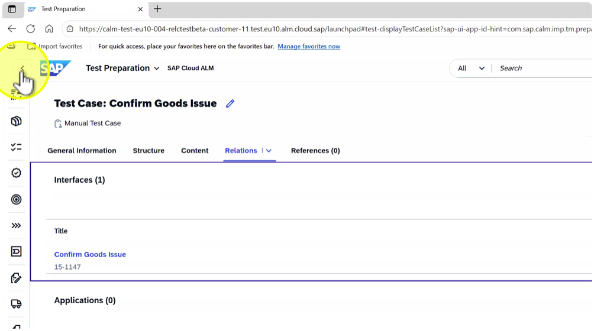
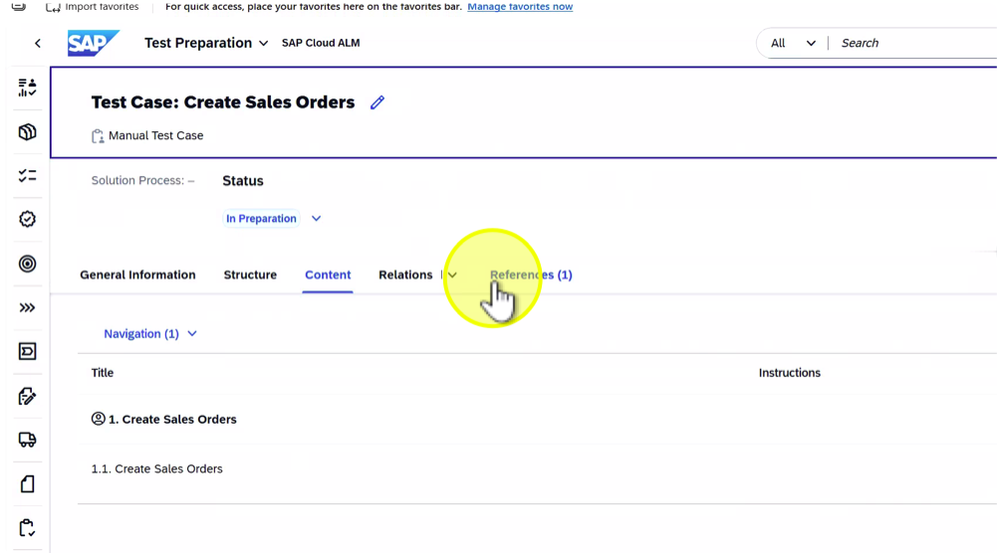
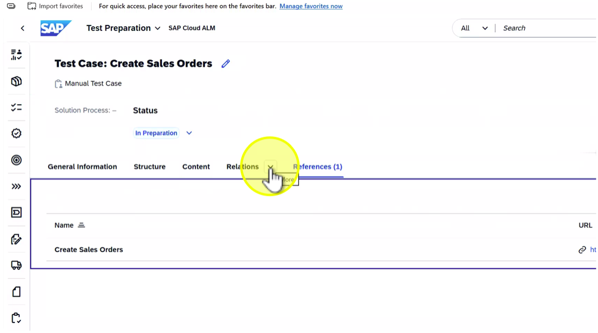
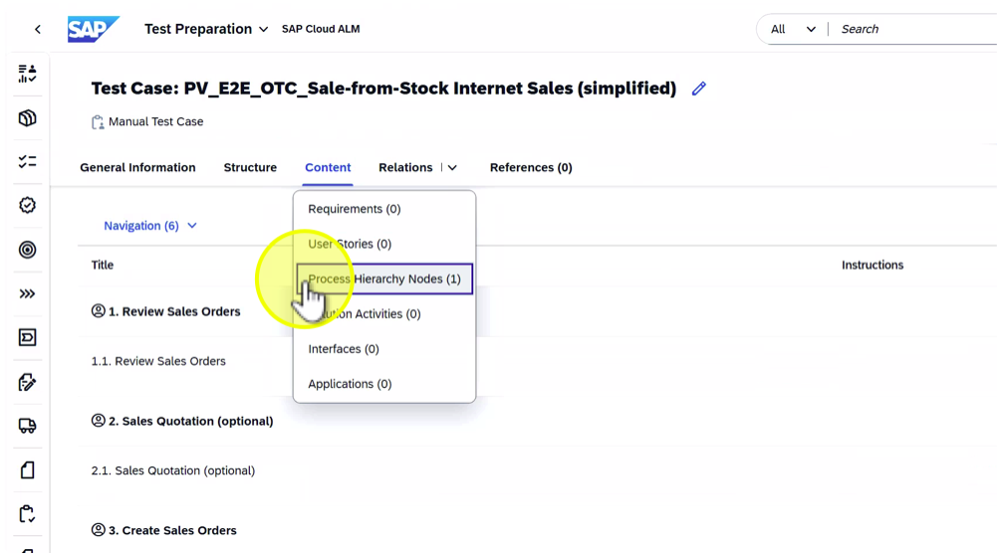

## Test Case (Test Step) upload to SAP Cloud ALM

## Description:

In this exercise, participants will upload the Test Steps exported from SAP Solution Manager into SAP Cloud ALM based on Selective Data Transfer (SDT) functionality. Test Steps define the detailed actions to be performed within a test and are linked to the corresponding processes or activities. This upload ensures that detailed testing information is retained after migration.

## Objective:

Learn how to upload Test Steps into SAP Cloud ALM, verify the upload results, and confirm that the test steps are correctly linked to their related processes in the system.

Duration:

## Credentials:

User: HO_SDT 
Password: SDT_to_CALM

## Step-by-Step Guide:

1. Click on tile "Test Preparation"

2. Click on “Upload”

3. Open value list for “Scope”

4. Select “Demo\_SDT\_Scope”

5. Click on “Browse...”

6. Search for the file to be uploaded

Note: Each student should upload their assigned file to ensure data isolation. (HO\_##...) (## = Student Number)

7. Select file "HO\_##\_Test\_Steps.xlsx” (## = Student Number)

8. Click on “Open”

9. Click on "Upload"

10. Click on "Continue"

11. Open filter for “Tags”

Note: The demo Selective Data Transfer (SDT) files include a dedicated tag HO\_## (## = Student Number) to make it easier to identify and select your assigned content during the exercises. This tag helps ensure that each participant works only with their own dataset, maintaining clear data separation and simplifying filtering in SAP Cloud ALM after upload.

12. Select “Selective Data Transfer: HO\_##” (## = Student Number)

Note: Review the availability of various owner after SDT upload.During the Selective Data Transfer (SDT), information about content owners maintained in SAP Solution Manager can be included in the export.

When imported into SAP Cloud ALM, these ownership details are automatically assigned to the corresponding processes.

18. Click here

19. Click on “Confirm Goods Issue”

21. Click on "Relations" drop down

Note: Validate that the test cases include the expected relations to other elements, e.g. Libraries.

22. Select "Interface”

23. Click on “<” (Back)

24. Click on “Create Sales Order”

25. Click on tab “References”

26. Click on “Relations” drop down

27. Select “Solution Activities”

28. Click on “<” (Back)

29. Click on “E2E\_OTC\_Sale-from-Stock Direct Sales”

30. Click on “Relations” drop down

31. Select “Process Hierarchy Nodes”

32. Click on “<” (Back)

33. Click on “PV\_E2E\_O2C\_Sale-from-Stock Internet Sales (simplified)”

34. Click on “Relations” drop down

35. Select “Process Hierarchy”

36. Click on tab “Structure”

37. Click on "Application"

Note: In SAP Cloud ALM, each Test Case can be linked to an Application that represents the SAP or non-SAP system where the test is executed.

This linkage helps testers understand the system context of each test and ensures that execution results are tied to the correct technical environment.

38. Close newly opened browser tab

Note: If required you can log on to S4HANA via User: BAUERA, PW: Solman72

39. Click on "Application" drop down

41. Check maintained application

43. Click on “<” (Back)

44. Click on “<” (Back)

Summary:

In this exercise, participants uploaded the Test Steps exported from SAP Solution Manager into SAP Cloud ALM. They learned how to:- Perform an SDT upload for Test Steps.- Verify imported Test Steps in the SAP Cloud ALM Test Steps view.- Confirm relationships between Test Steps and their processes.- Use tags to identify uploaded Test Steps in multi-user environments.Key takeaway: Uploading Test Steps ensures that detailed testing instructions and process-specific actions from SAP Solution Manager are accurately migrated to SAP Cloud ALM, maintaining test readiness and traceability.

# Continue to next exercise - [Verify SDT Upload and Completion](../SDT_VERIFY_PHA/SDT_VERIFY_PHA.md)
