## Solution Traceability Report

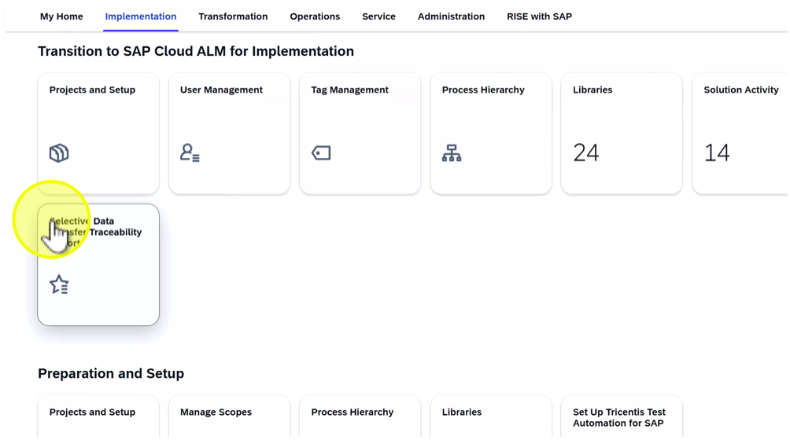

1. Click on tile”Selective Data Transfer Traceability Report”

Note: The report gives an end-to-end overview of process relationships, showing how processes, test cases, requirements, defects, and documents are connected.

2. Click on “Select View”

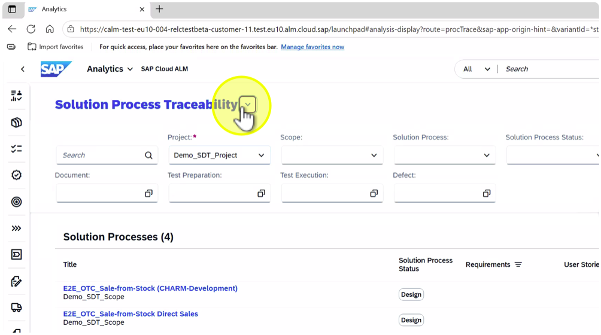

3. Select “SDT Traceability”

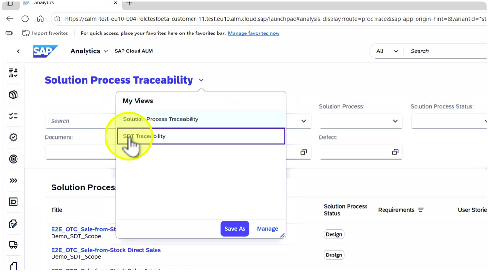

Note: The visualization displays relationships between process elements imported from SDT, confirming that connections have been preserved.

4. Opern filter for “Tags”

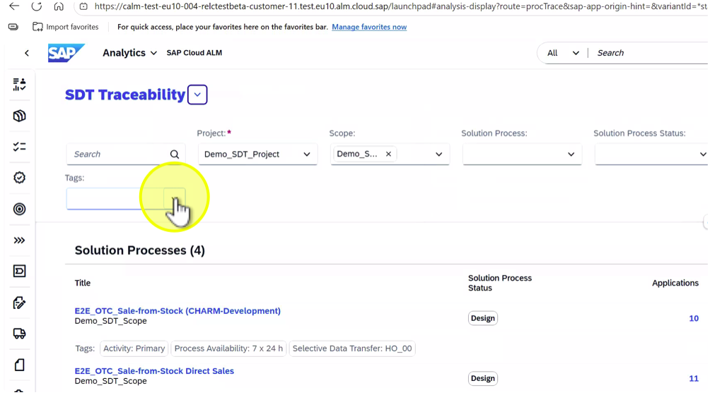

Note: The demo Selective Data Transfer (SDT) files include a dedicated tag “Selective Data Transfer: HO\_## (## = Student Number) to make it easier to identify and select your assigned content during the exercises. This tag helps ensure that each participant works only with their own dataset, maintaining clear data separation and simplifying filtering in SAP Cloud ALM after upload.

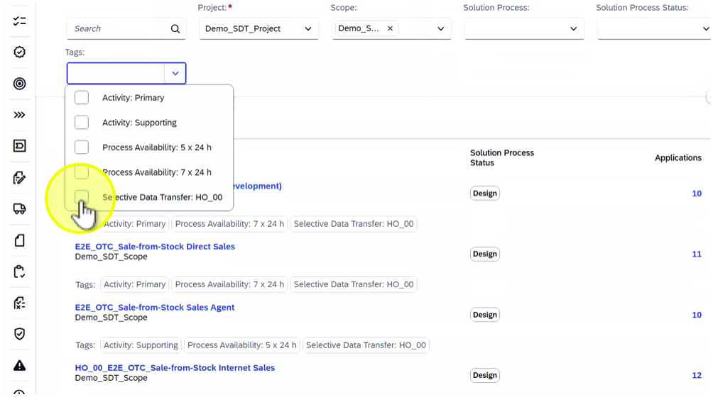

5. Select “Selective Data Transfer: HO\_## (## = Student Number)

6. Click outside the filter to close it

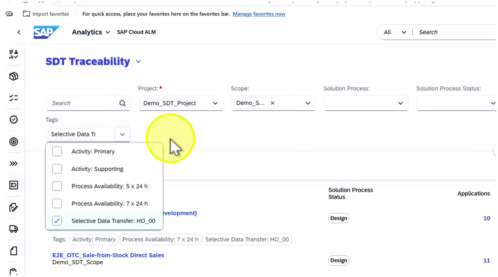

Note: Ensure that all imported items are correctly displayed within the traceability report, confirming consistent migration results.

7. Click on the link “E2E\_OTC\_Sale-from-Stock Direct Sales”

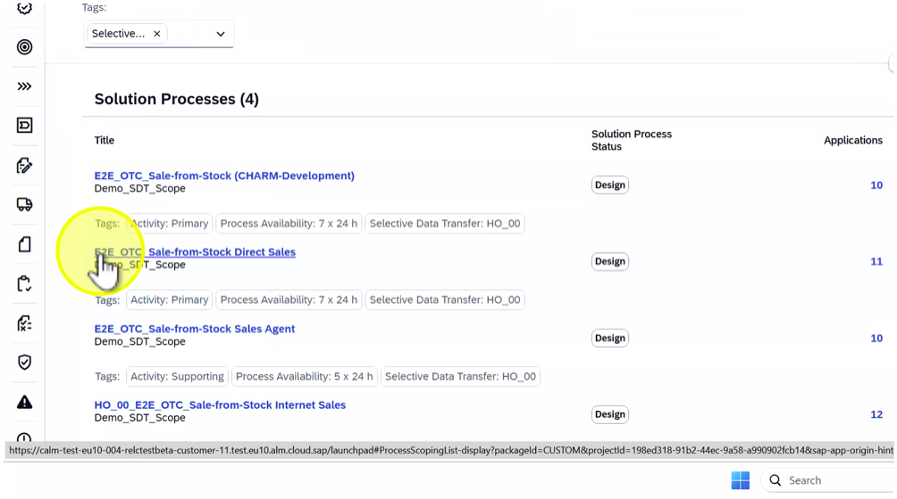

Note: Verify that document references and testing assets remain accessible and connected to the relevant processes.

8. Click on “<” (Back)

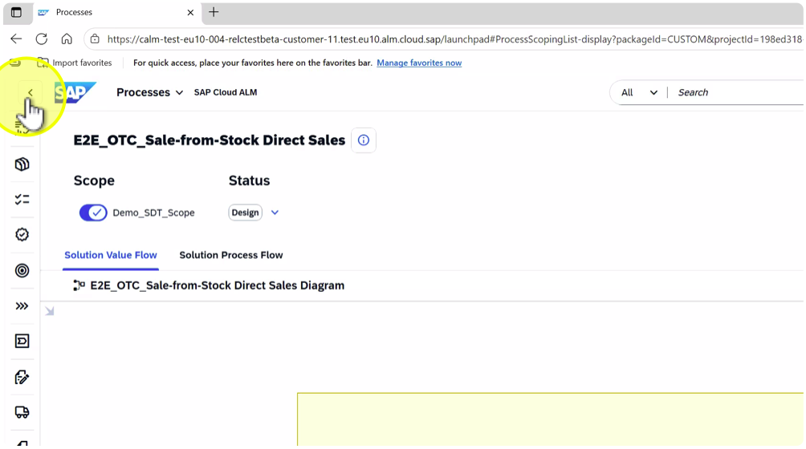

9. Click on the row of “E2E\_OTC\_Sale-from-Stock Direct Sales”

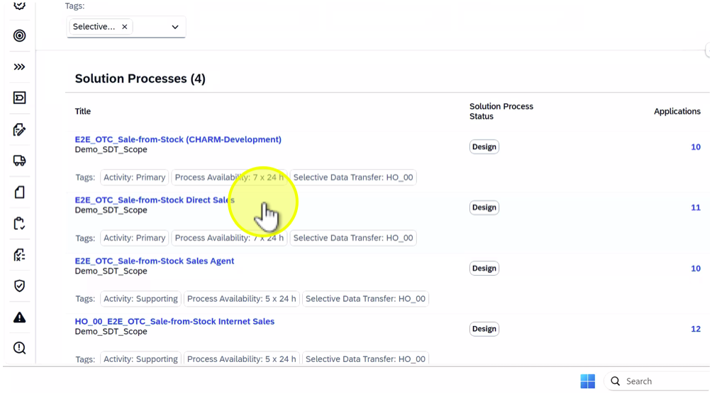

11. Click on tab "Document"

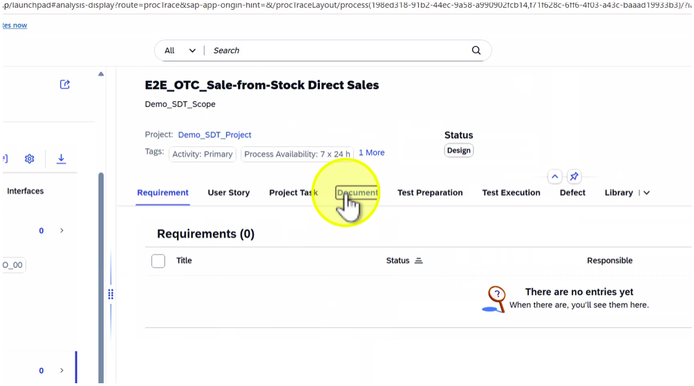

12. Click on tab "Test Preparation"

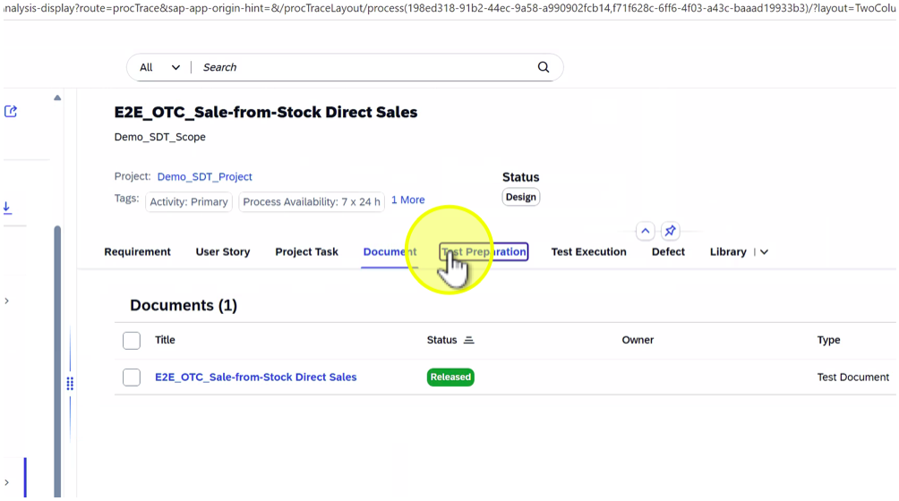

13. Click on "Library" drop down

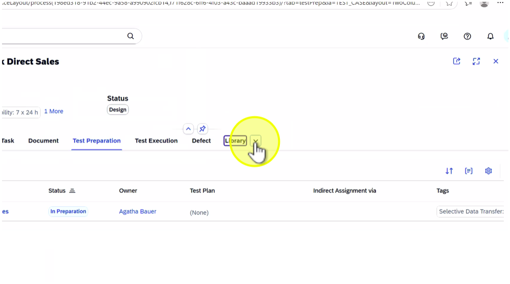

14. Select "Application"

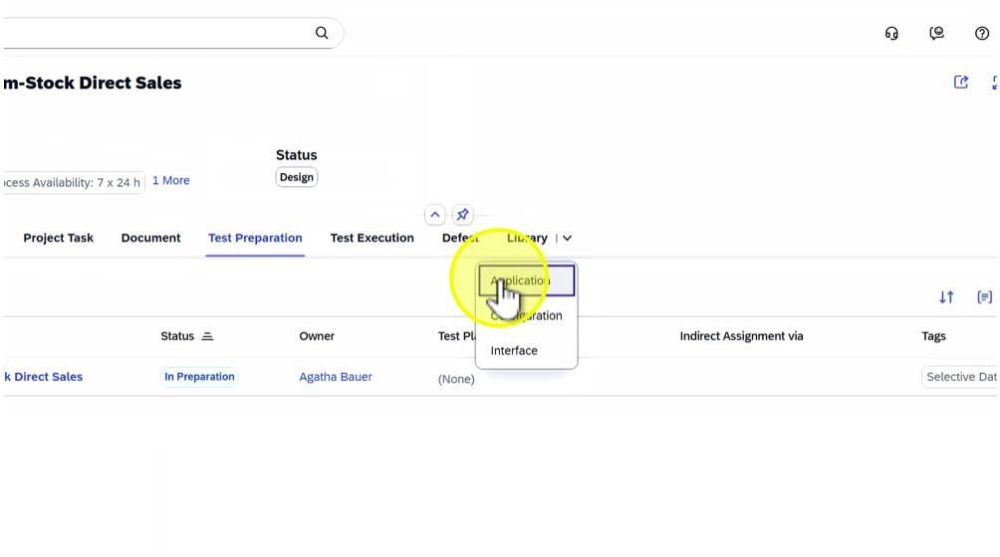

15. Click on "Library" drop down

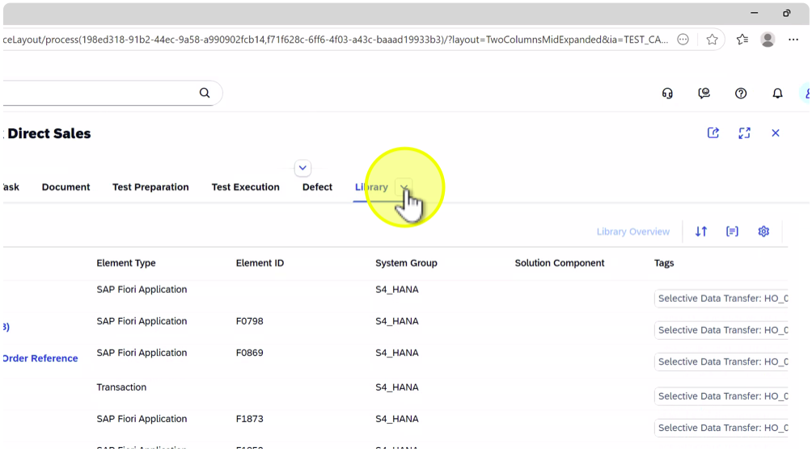

16. Select "Configuration"

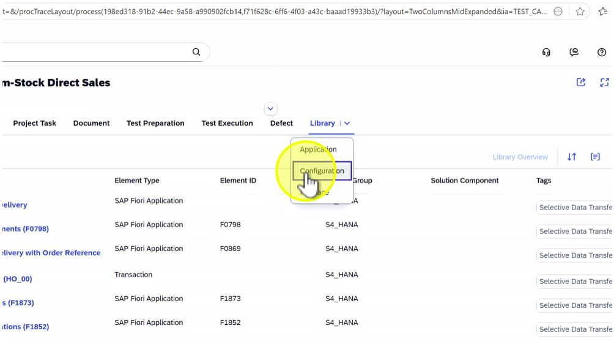

17. Click on “x” (Close) to close the detail view

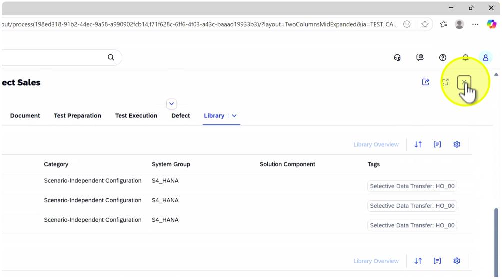

18. Click on down arrow next to the application name (“Analytics”)

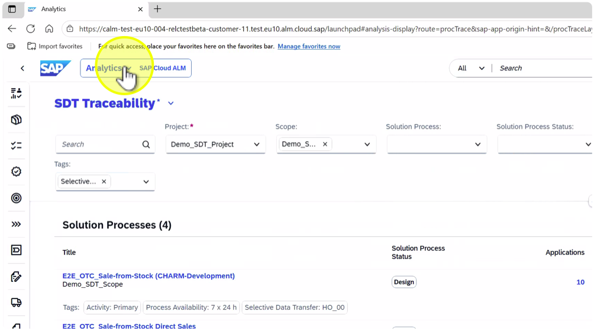

19. Select Implementation

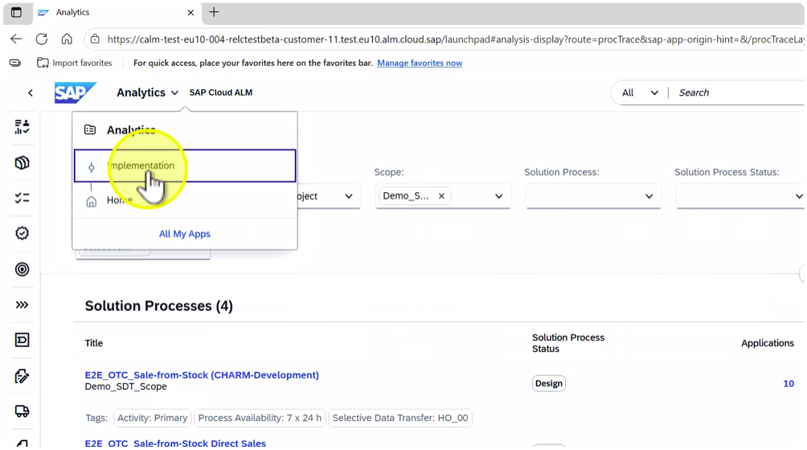

Summary:

In this exercise, participants verified the results of the SDT upload in SAP Cloud ALM by checking the Process Hierarchy and the Solution Process Traceability Report. They learned how to:- Review imported processes and confirm proper hierarchy assignment.- Validate connections between processes, libraries, configurations, and applications.- Use the Solution Process Traceability Report to ensure end-to-end data integrity.Key takeaway: Verifying SDT results through the Process Hierarchy Assignment and Traceability Report ensures that business processes, technical components, and testing artifacts remain connected in SAP Cloud ALM, providing full traceability and transparency across the solution lifecycle.
