# Google Chrome
Schulze, Axel | 14 steps | 2 minutes 
25. September 2025 
#### 1. Click here 
 
#### 2. Click here 
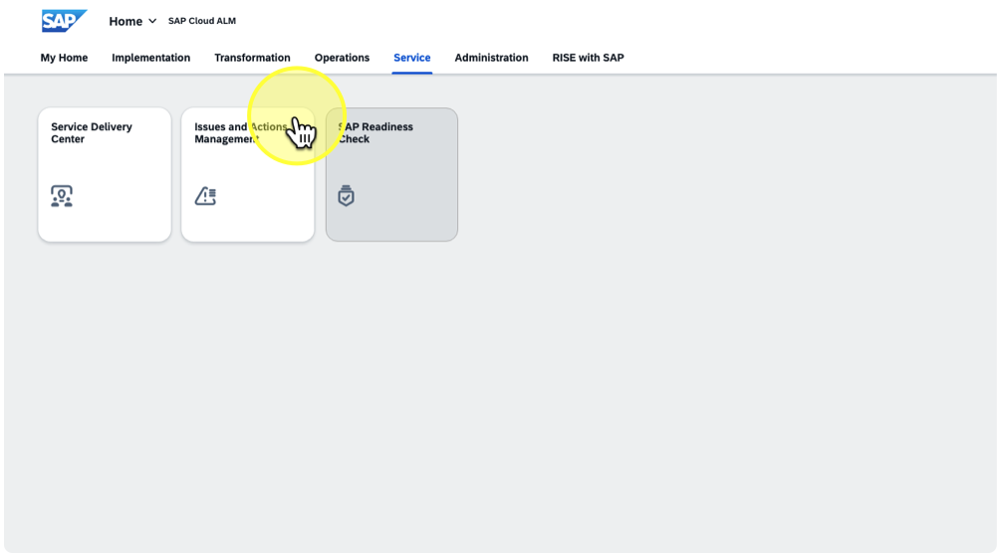 
#### 3. Click on "DEMO SDT Analyses" 
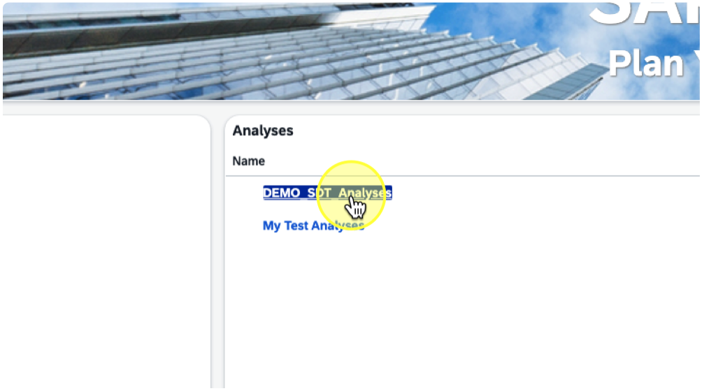 
#### 4. Click here 
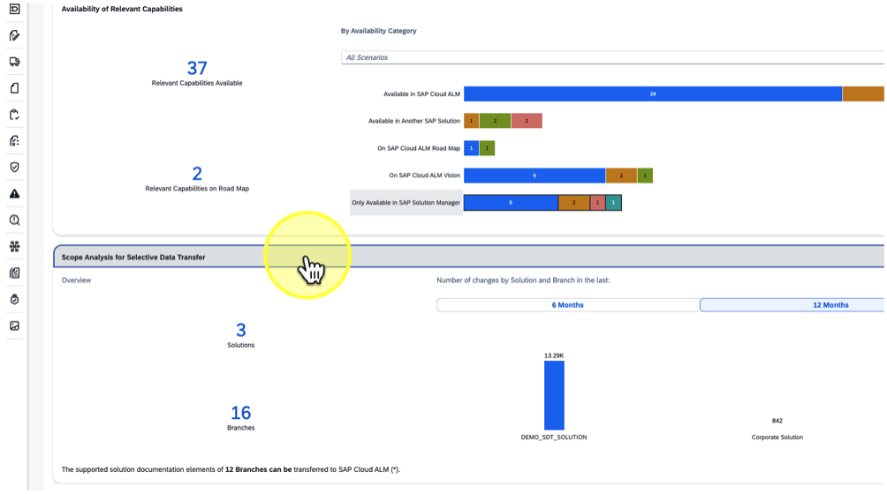 
#### 5. Click on "last changed on 02/09/2025" 
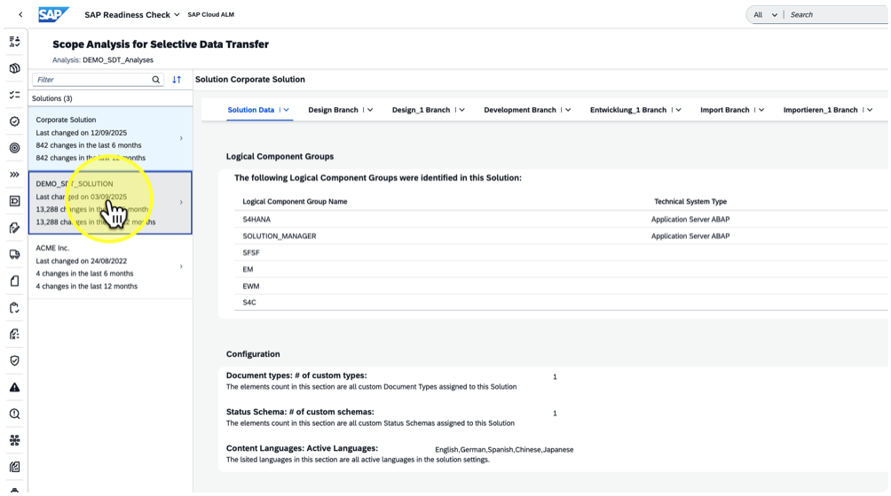 
#### 6. Click on "Scopes" 
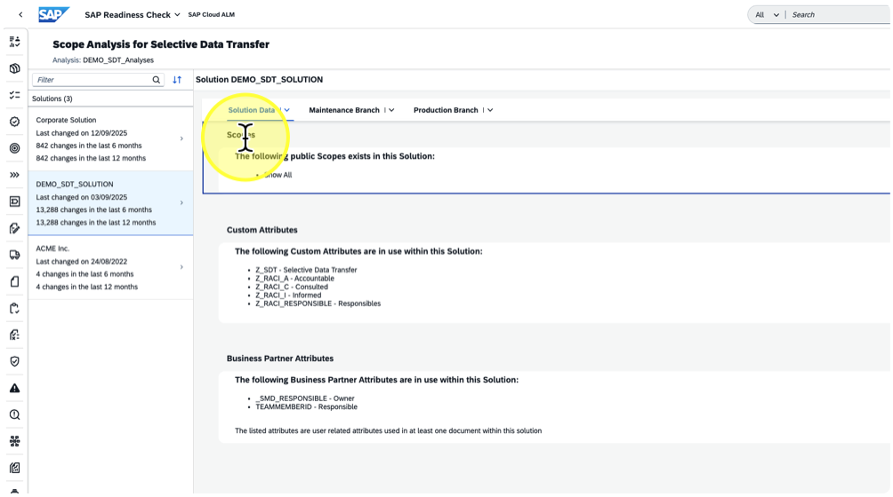 
#### 7. Click on "custom Attributes" 
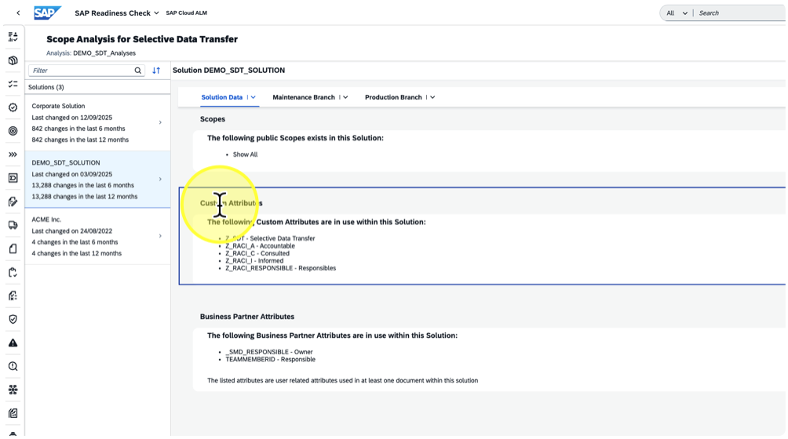 
#### 8. Click on "Business Partner Attributes" 
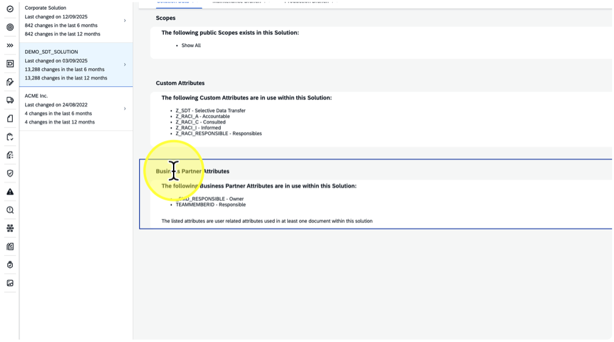 
#### 9. Click on "Solution Data Maintenance Branch" 
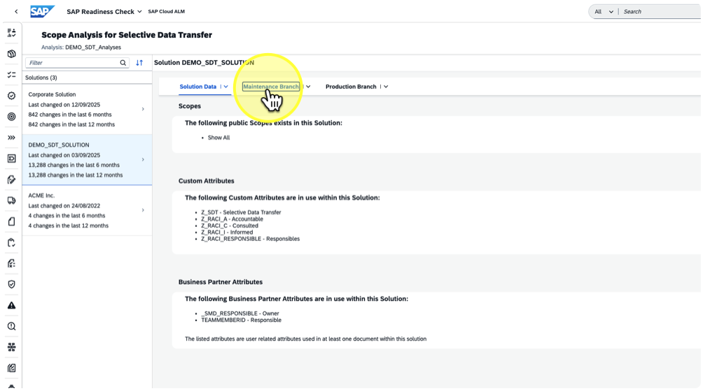 
#### 10. Click on "step 1 - Process Hierarchy" 
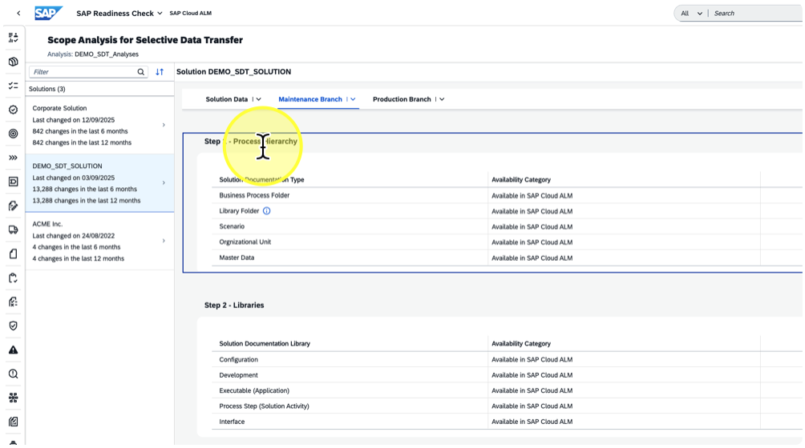 
#### 11. Click on "Step 2 - Libraries" 
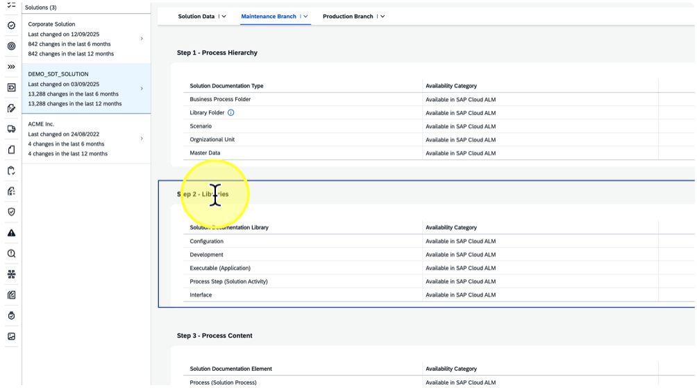 
#### 12. Click on "Step 3 - Process content" 
 
#### 13. Click on "Step 4 - Documents and Test Steps" 
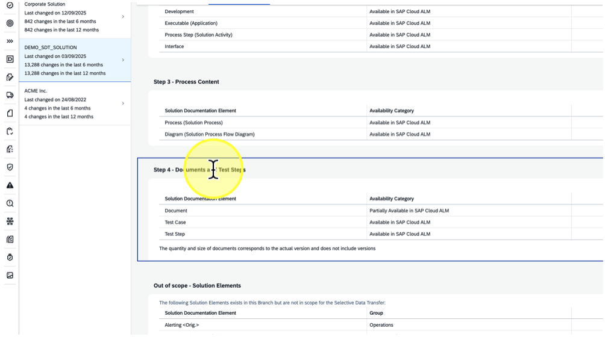 
#### 14. Click on "Used Solution Documentation Relations" 
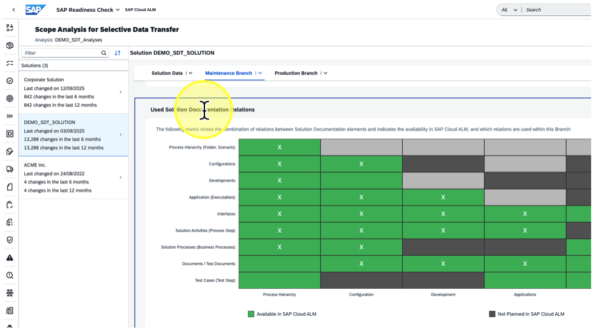 